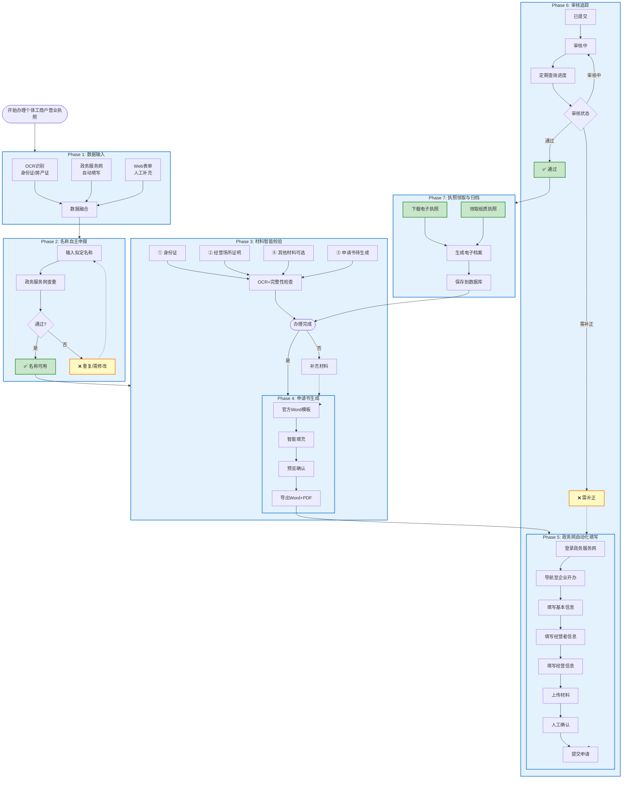

# 市场监管智能体 - 工作流流程图总览

**项目**: 市场监管智能体 v4.0
**更新时间**: 2026-01-14
**完整文档**: [docs/WORKFLOW_DESIGN.md](WORKFLOW_DESIGN.md)

---

## 🎯 完整工作流流程图

### 7个阶段全流程



---

## 📊 各阶段详细说明

### Phase 1: 数据输入（三输入源）

**输入源①: OCR识别**
```
上传照片 → OCR识别 → 提取信息
├─ 身份证正面 → 姓名、身份证号
├─ 身份证反面 → 有效期、签发机关
├─ 房产证 → 产权人、地址、面积
└─ 租赁合同 → 房东、期限、金额
```

**输入源②: 政务服务网**
```
登录zwfw.gxzf.gov.cn → 名称查重 → 提取数据
├─ 名称预先核准
├─ 统一社会信用代码
└─ 表单自动填写数据
```

**输入源③: Web表单**
```
Flask/Streamlit界面 → 手动输入
├─ 补充缺失信息
├─ 修正OCR错误
└─ 添加额外信息
```

**数据融合优先级**: Web表单 > 政务服务网 > OCR

---

### Phase 2: 名称自主申报

```
输入拟定名称
    ↓
政务服务网查重
    ↓
┌───┴───┐
│ 通过?  │
└───┬───┘
    ├─ 是 → ✅ 保存可用名称
    └─ 否 → ❌ 生成新建议/手动输入
```

**名称格式**: 行政区划 + 字号 + 行业 + 组织形式
- 例如: 南宁市青秀区 + 张三 + 便利店 + 个体工商户

---

### Phase 3: 材料智能校验

**官方材料清单**:

| 材料 | 状态 | OCR支持 | 说明 |
|------|------|---------|------|
| ① 经营者身份证 | ✅ 必需 | ✅ | 正反面 |
| ② 经营场所证明 | ✅ 必需 | ✅ | 房产证/租赁合同 |
| ③ 申请书 | ✅ 系统生成 | - | Word+PDF |
| ④ 委托书 | ○ 可选 | - | 如有代理人 |
| ⑤ 特殊行业许可 | ○ 按需 | - | 餐饮许可证等 |

**材料状态**: ○待上传 → ↑已上传 → ✓已验证 → ✗无效

---

### Phase 4: 申请书生成

**使用官方模板**: 《个体工商户登记（备案）申请书》

**智能填充流程**:
```
融合数据 → 应用默认值 → 完整性检查 → 生成文档 → 预览确认 → 签名导出
```

**申请书内容**:
- 基本信息: 名称、统一社会信用代码、注册日期
- 经营者信息: 姓名、身份证号、住址、电话
- 经营信息: 场所、范围、从业人数、注册资金
- 经营范围: 许可经营项目 + 一般经营项目

---

### Phase 5: 政务网自动化填写

**目标平台**:
- 主平台: https://zwfw.gxzf.gov.cn/ (广西数字政务一体化平台)
- 备用: https://zhjg.scjdglj.gxzf.gov.cn:9087/ (广西经营主体登记平台)

**自动化流程** (✅ 已实现优先级1):
```
✅ 1. 自动登录 (持久化会话)
✅ 2. 导航至企业开办一件事
⏳ 3. 选择个体工商户设立登记
⏳ 4. 自动填写表单
⏳ 5. 自动上传材料
⏳ 6. 人工确认
⏳ 7. 提交申请
```

**当前状态**: ✅ 优先级1已完成（登录和会话管理）

---

### Phase 6: 审核进度追踪

**审核状态流转**:
```
已提交 → 审核中 → 需补正 → 审核通过
   ↓        ↓        ↓         ↓
获得回执  等待    修改材料   领取执照
        审核结果  并重新提交
```

**进度查询**:
- 自动定期查询（每30分钟）
- 人工触发查询
- 状态变化通知
- 进度记录存档

---

### Phase 7: 执照领取与归档

**① 电子营业执照**:
```
自动下载 → 提取统一社会信用代码 → 保存到数据库 → 归档
```

**② 纸质营业执照**:
```
邮寄领取 → 记录快递单号
或
现场领取 → 保存领取记录
```

**③ 电子档案打包**:
```
经营者姓名_身份证后4位_日期/
├─ 01_身份证原件/
├─ 02_经营场所证明/
├─ 03_申请书/
│   ├─ 申请书.docx
│   └─ 申请书.pdf
├─ 04_申请回执/
├─ 05_营业执照/
│   ├─ 电子执照.pdf
│   └─ 纸质执照扫描件.jpg
├─ 06_办理记录/
│   └─ 流程报告.json
└─ 99_经营户数据.json
```

---

## 🎯 当前实现状态

| 阶段 | 功能模块 | 状态 | 完成度 | 关键文件 |
|------|---------|------|--------|----------|
| **Phase 1** | 数据输入 | ✅ 完成 | 90% | `src/baidu_ocr_engine.py`, `ui/flask_app.py` |
| **Phase 2** | 名称申报 | ⏸️ 待开发 | 0% | 计划中 |
| **Phase 3** | 材料校验 | ✅ 部分完成 | 60% | `src/material_manager.py` |
| **Phase 4** | 申请书生成 | ✅ 完成 | 95% | `jinja2_filler.py`, `src/application_generator.py` |
| **Phase 5** | 政务网填写 | ✅ 部分完成 | 30% | `src/session_manager.py` ✅ |
| **Phase 6** | 审核追踪 | ⏸️ 待开发 | 0% | 计划中 |
| **Phase 7** | 执照领取 | ⏸️ 待开发 | 0% | 计划中 |

**总体完成度**: 约 35%

---

## 🔧 技术实现架构

### 核心模块

```
┌─────────────────────────────────────────────────────────┐
│                    Flask Web UI                         │
│              (ui/flask_app_workflow.py)                │
└──────────────────────┬──────────────────────────────────┘
                       │
        ┌──────────────┼──────────────┐
        │              │              │
        ▼              ▼              ▼
┌─────────────┐ ┌─────────────┐ ┌──────────────┐
│  OCR引擎    │ │ 会话管理器   │ │  申请书生成  │
│ OCR Engine  │ │Session Mgr   │ │ App Generator│
└─────────────┘ └─────────────┘ └──────────────┘
```

### 数据流

```
用户输入
   ↓
┌─────────┐    ┌─────────┐    ┌─────────┐
│ OCR识别 │ →  │ 数据融合 │ →  │ 申请书  │
└─────────┘    └─────────┘    │ 生成    │
                              └─────────┘
                                 ↓
                           ┌─────────┐
                           │ 政务网  │
                           │ 自动填写 │
                           └─────────┘
```

---

## 🚀 下一步开发计划

### 短期（优先级2-3）

1. **优先级2: 名称自主申报** ⏸️
   - 政务服务网查重集成
   - 智能名称推荐
   - 本地规则预检查

2. **优先级3: 经营场所证明识别** ⏸️
   - 房产证OCR识别
   - 租赁合同OCR识别
   - 地址信息提取

### 中期（优先级5-7）

3. **优先级5: 年报填写** ⏸️
   - 年报表单自动填写
   - 经营数据统计

4. **优先级6: 变更登记** ⏸️
   - 变更事项选择
   - 材料准备

5. **优先级7: 注销登记** ⏸️
   - 清税证明集成
   - 注销流程自动化

---

## 📚 相关文档

- **完整工作流设计**: [docs/WORKFLOW_DESIGN.md](WORKFLOW_DESIGN.md)
- **统一工作流指南**: [docs/UNIFIED_WORKFLOW_GUIDE.md](UNIFIED_WORKFLOW_GUIDE.md)
- **项目进度报告**: [docs/PROJECT_PROGRESS_REPORT.md](PROJECT_PROGRESS_REPORT.md)
- **持久化会话指南**: [docs/PERSISTENT_SESSION_GUIDE.md](PERSISTENT_SESSION_GUIDE.md)

---

**文档生成时间**: 2026-01-14 23:45:00
**项目版本**: v4.0
**生成工具**: Claude Code (GLM-4.7)
