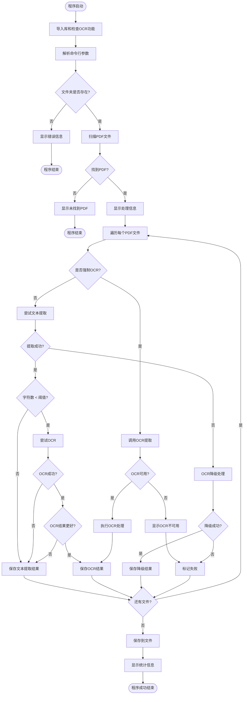
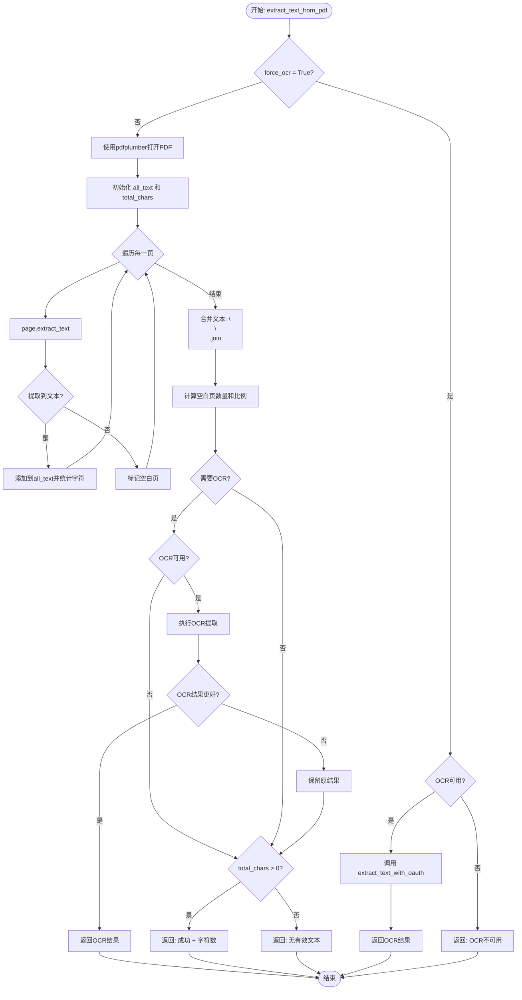
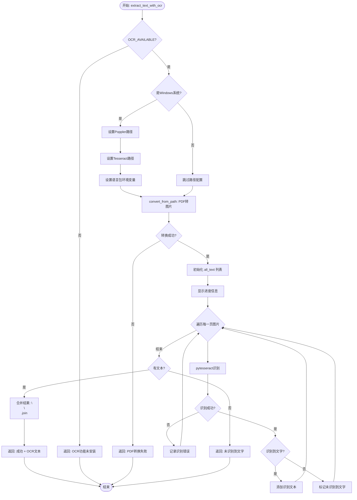
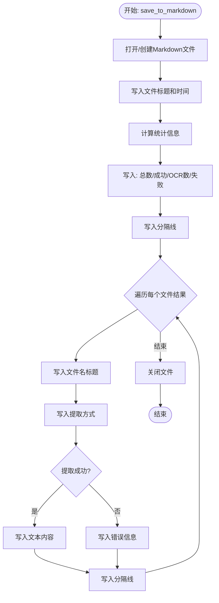
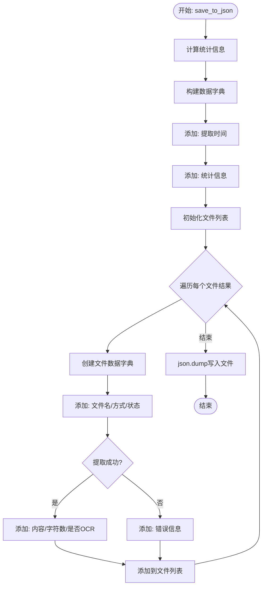
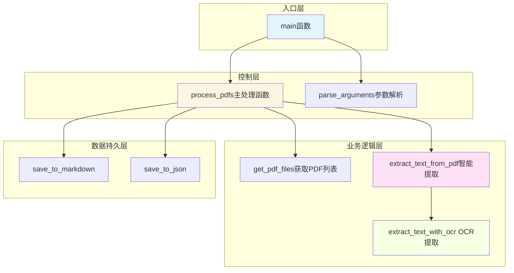
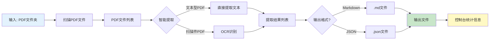
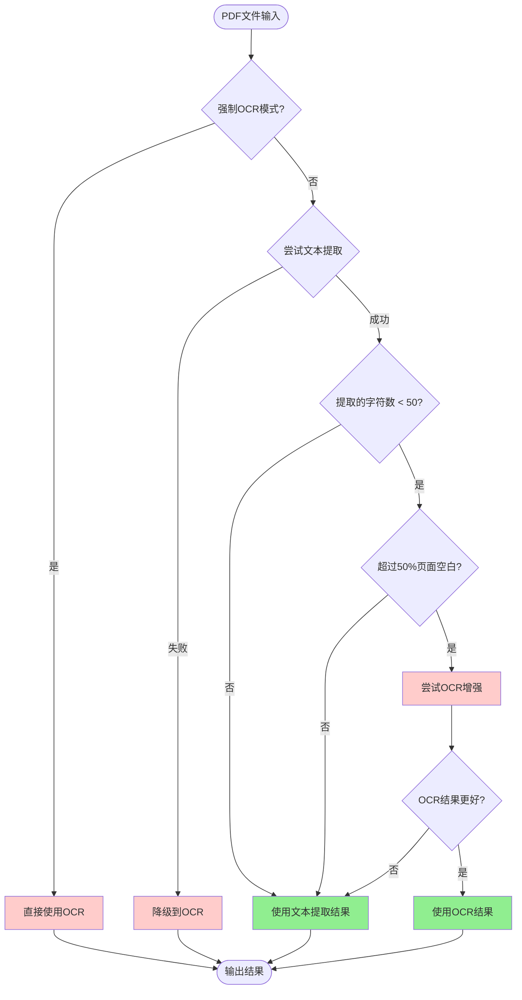
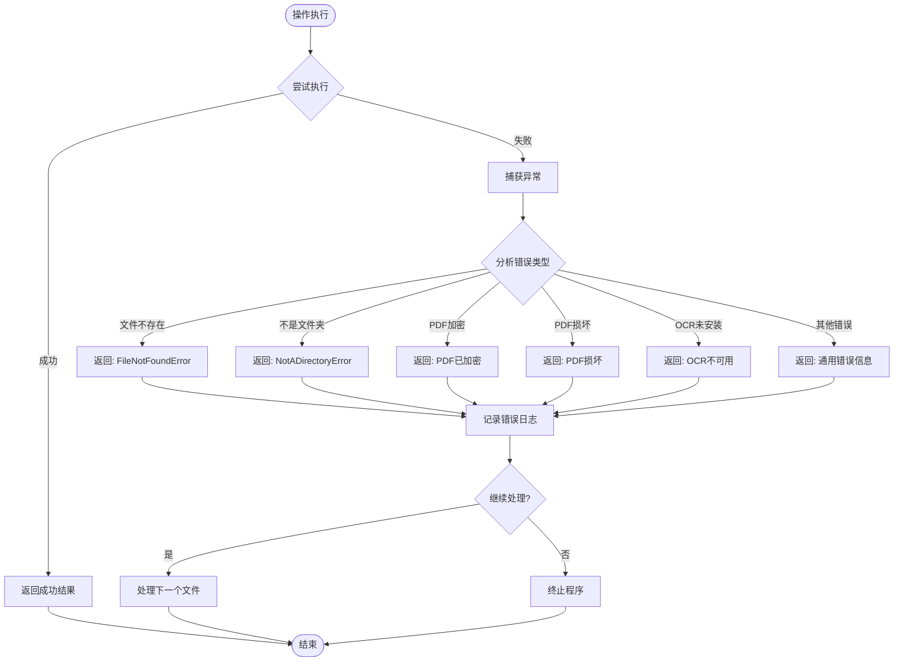

# PDF 文本提取器 - 程序流程图

## 主流程图



---

## 核心函数：extract_text_from_pdf() 流程图



---

## OCR函数：extract_text_with_ocr() 流程图



---

## 文件保存流程图

### save_to_markdown() 流程



### save_to_json() 流程



---

## 程序模块关系图



---

## 数据流向图



---

## 决策树：PDF 处理策略



---

## 错误处理流程图



---

## 关键数据结构

### 提取结果元组
```python
(
    filename: str,      # 文件名
    content: str,       # 提取的文本内容
    success: bool,      # 是否成功
    method: str         # 提取方式说明
)
```

### OCR 返回元组
```python
(
    text: str,          # 提取的文本
    success: bool,      # 是否成功
    message: str        # 提取方式或错误信息
)
```

### JSON 输出结构
```json
{
  "提取时间": "2026-01-06 10:30:00",
  "统计": {
    "总文件数": 10,
    "成功提取": 8,
    "使用OCR的文件数": 3,
    "提取失败": 2
  },
  "文件": [
    {
      "文件名": "example.pdf",
      "提取方式": "(文本提取, 1500字符)",
      "状态": "成功",
      "内容": "...",
      "字符数": 1500,
      "是否OCR": false
    }
  ]
}
```

---

## 总结

这个程序的核心特点：

1. **智能降级**：文本提取 → 自动OCR → 强制OCR
2. **容错机制**：单个文件失败不影响其他文件
3. **灵活输出**：支持 Markdown 和 JSON 两种格式
4. **详细统计**：记录提取方式、字符数、成功率等信息
5. **编码处理**：Windows 控制台 UTF-8 编码修复

程序采用**模块化设计**，每个函数职责单一，便于维护和扩展。
