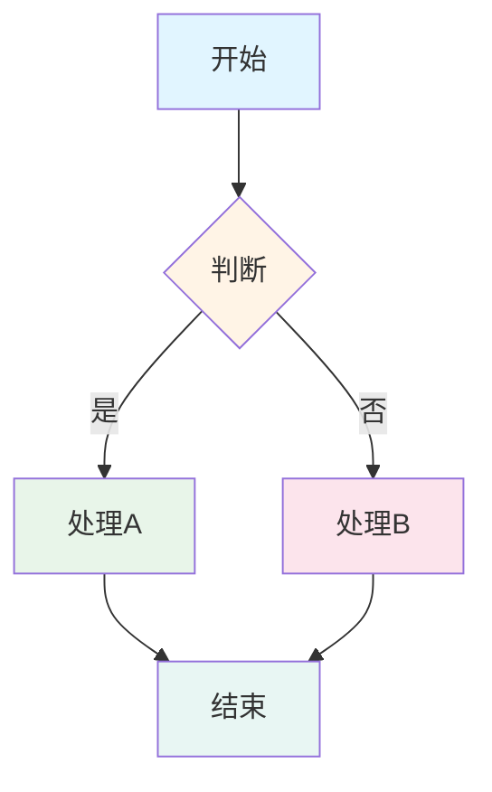
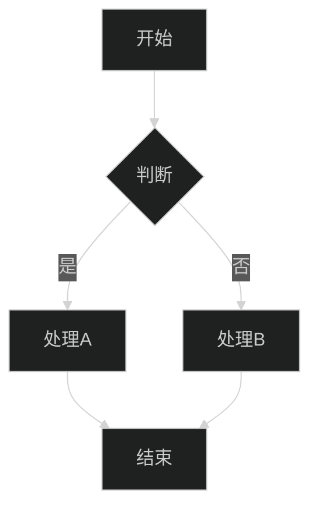
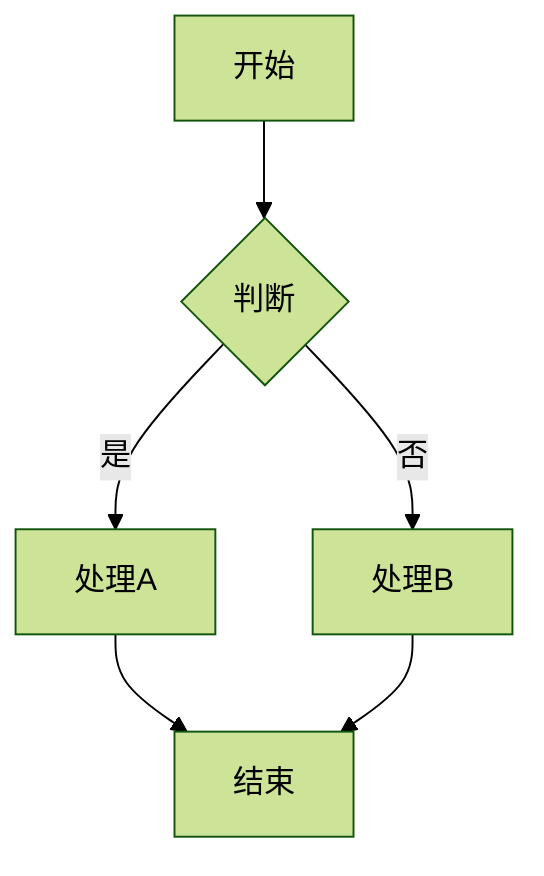
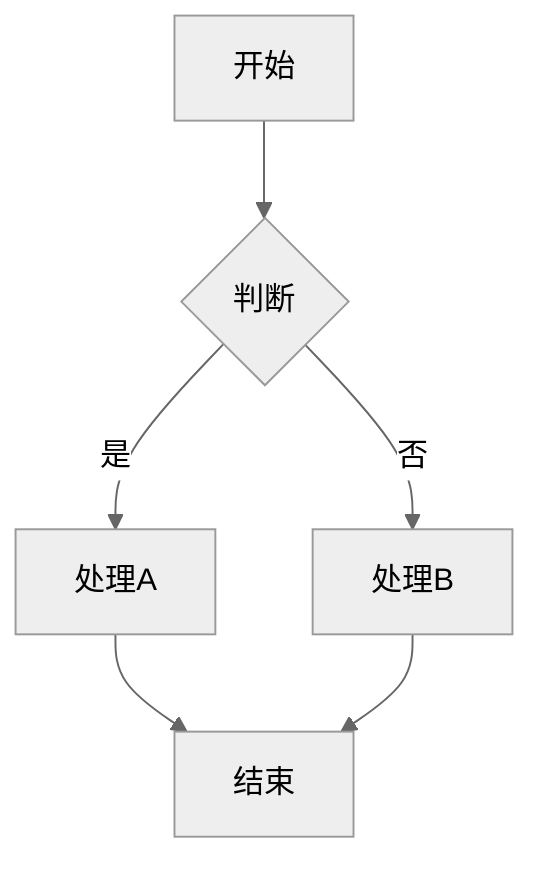
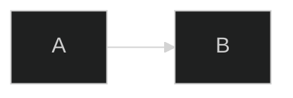

# Mermaid 主题预览

本文档展示所有可用的 Mermaid 主题效果。

---

## 1. Default 主题（默认）



**特点**: 清爽明亮，适合日常文档

---

## 2. Dark 主题（深色）



**特点**: 深色背景，适合夜间模式

---

## 3. Forest 主题（森林）



**特点**: 绿色调，自然清新

---

## 4. Neutral 主题（中性）



**特点**: 灰色调，专业商务

---

## 如何切换主题

### VSCode 设置

在 `.vscode/settings.json` 中：

```json
{
  "mermaid.theme": "forest"  // default/dark/forest/neutral
}
```

### 在 Markdown 中局部指定



---

**生成日期**: 2026-01-16
