# 个体工商户营业执照办理 - 完整工作流设计

> 基于广西政务服务官方流程调研
> 生成时间: 2026-01-14

---

## 📊 完整流程图（官方 + 我们的工作流）

```mermaid
flowchart TD
    Start([开始办理]) --> Phase1{数据输入阶段}

    %% ========== 数据输入阶段 ==========
    subgraph Phase1["Phase 1: 数据输入（三输入源）"]
        direction LR
        Input1[输入源①: OCR识别<br/>上传证件照片]
        Input2[输入源②: 政务服务网<br/>自动填写+提取]
        Input3[输入源③: Web表单<br/>人工补充]

        Input1 --> Data1[经营者信息<br/>经营场所信息]
        Input2 --> Data2[名称申报结果<br/>表单填写数据]
        Input3 --> Data3[补充信息<br/>修正数据]

        Data1 & Data2 & Data3 --> Merge[数据融合]
    end

    Merge --> Phase2

    %% ========== Phase 2: 名称自主申报 ==========
    subgraph Phase2["Phase 2: 名称自主申报"]
        NameInput[输入拟定名称]
        NameCheck[政务服务网自动查重]
        NameResult{查重结果}
        NamePass[✅ 名称可用]
        NameFail[❌ 名称重复]

        NameInput --> NameCheck
        NameCheck --> NameResult
        NameResult -->|通过| NamePass
        NameResult -->|不通过| NameFail
        NameFail -.->|建议新名称| NameInput
        NameFail -.->|人工确认| NamePass
    end

    NamePass --> Phase3

    %% ========== Phase 3: 材料智能校验 ==========
    subgraph Phase3["Phase 3: 材料智能校验"]
        direction LR
        MaterialList[官方材料清单]

        M1[① 经营者身份证<br/>状态: 待上传]
        M2[② 经营场所证明<br/>状态: 待上传]
        M3[③ 个体工商户<br/>登记申请书<br/>状态: 待生成]
        M4[④ 法律规定的<br/>其他材料<br/>状态: 可选]

        Check1[OCR识别+校验]
        Check2[文件完整性检查]
        Check3[申请书模板匹配]

        M1 & M2 & M3 & M4 --> Check1
        Check1 --> Check2
        Check2 --> Check3
        Check3 --> MaterialResult{材料齐全?}
    end

    MaterialResult -->|是| Phase4
    MaterialResult -->|否| Supplement[数据补充]
    Supplement -.->|补充后| Phase4

    %% ========== Phase 4: 申请书生成 ==========
    subgraph Phase4["Phase 4: 申请书生成"]
        direction TB
        Template[官方模板<br/>《个体工商户登记<br/>（备案）申请书》]

        DataMerge[融合后的完整数据]
        AutoFill[智能填充]
        Preview[预览确认]
        Export[导出Word+PDF]

        DataMerge --> AutoFill
        AutoFill --> Template
        Template --> Preview
        Preview --> Export
    end

    Export --> Phase5

    %% ========== Phase 5: 政务服务网填写 ==========
    subgraph Phase5["Phase 5: 政务服务网自动化填写"]
        direction TB
        Login[登录政务服务网<br/>zwfw.gxzf.gov.cn]

        Navigate[导航至<br/>企业开办一件事]

        AutoFill1[自动填写: 经营者信息]
        AutoFill2[自动填写: 经营信息]
        AutoFill3[自动上传: 材料文件]

        Confirm[人工确认]
        Submit[提交申请]

        Login --> Navigate
        Navigate --> AutoFill1
        AutoFill1 --> AutoFill2
        AutoFill2 --> AutoFill3
        AutoFill3 --> Confirm
        Confirm --> Submit
    end

    Submit --> Phase6

    %% ========== Phase 6: 审核追踪 ==========
    subgraph Phase6["Phase 6: 审核进度追踪"]
        direction TB
        Submitted[已提交]
        Reviewing[审核中]
        QueryProgress[定期查询进度]

        Submitted --> Reviewing
        Reviewing --> QueryProgress

        QueryProgress --> Status{审核状态}
        Status -->|通过| Success[✅ 审核通过]
        Status -->|需补正| NeedFix[❌ 需要补正]
        Status -->|审核中| Reviewing
    end

    Success --> Phase7
    NeedFix -.->|补正材料| Supplement
    NeedFix -.->|修改信息| AutoFill1

    %% ========== Phase 7: 执照领取与归档 ==========
    subgraph Phase7["Phase 7: 执照领取与归档"]
        direction LR

        ELicense[下载<br/>电子营业执照]
        PLicense[领取/邮寄<br/>纸质营业执照]

        Archive1[生成电子档案]
        Archive2[保存到数据库]
        Archive3[材料归档]

        ELicense & PLicense --> Archive1
        Archive1 --> Archive2
        Archive2 --> Archive3
    end

    Archive3 --> Complete([办理完成])

    %% ========== 样式 ==========
    classDef inputBox fill:#e1f5fe,stroke:#01579b,stroke-width:2px
    classDef processBox fill:#f3e5f5,stroke:#4a148c,stroke-width:2px
    classDef checkBox fill:#fff9c4,stroke:#f57f17,stroke-width:2px
    classDef successBox fill:#c8e6c9,stroke:#1b5e20,stroke-width:2px
    classDef errorBox fill:#ffcdd2,stroke:#b71c1c,stroke-width:2px

    class Input1,Input2,Input3 inputBox
    class NameCheck,MaterialList,AutoFill,Login,Submit processBox
    class NameResult,MaterialResult,Status checkBox
    class NamePass,Success,ELicense,PLicense successBox
    class NameFail,NeedFix errorBox
```



---

## 🔄 工作流阶段详细说明

### Phase 1: 数据输入（三输入源）

```
┌──────────────────────────────────────────────────────────────┐
│ Phase 1: 数据输入                                           │
├──────────────────────────────────────────────────────────────┤
│                                                              │
│  输入源①: OCR识别                      │
│  ├─ 上传身份证照片 → 自动提取经营者信息                       │
│  ├─ 上传房产证 → 自动提取经营场所信息                         │
│  └─ 上传租赁合同 → 自动提取租赁信息                           │
│                                                              │
│  输入源②: 政务服务网                  │
│  ├─ 名称自主申报 + 查重                                      │
│  ├─ 自动填写表单                                             │
│  └─ 提取已填写数据回数据库                                   │
│                                                              │
│  输入源③: Web表单                     │
│  ├─ 手动补充缺失信息                                         │
│  ├─ 修正OCR识别错误                                          │
│  └─ 添加额外信息                                             │
│                                                              │
│  → 数据融合（优先级: Web表单 > 政务网 > OCR）                │
│                                                              │
└──────────────────────────────────────────────────────────────┘
```

### Phase 2: 名称自主申报

```
┌──────────────────────────────────────────────────────────────┐
│ Phase 2: 名称自主申报（新增功能）                           │
├──────────────────────────────────────────────────────────────┤
│                                                              │
│  1. 输入拟定名称                                             │
│     ├─ 格式: 行政区划 + 字号 + 行业 + 组织形式              │
│     │  例如: 南宁市青秀区 + 张三 + 便利店 + 个体工商户       │
│     └─ 支持批量生成名称建议                                  │
│                                                              │
│  2. 政务服务网自动查重                                       │
│     ├─ 登录 https://zwfw.gxzf.gov.cn/                       │
│     ├─ 导航至名称申报模块                                    │
│     ├─ 自动输入名称并查重                                    │
│     └─ 获取查重结果                                          │
│                                                              │
│  3. 查重结果处理                                             │
│     ├─ ✅ 通过 → 保存可用名称                                │
│     ├─ ❌ 重复 → 生成新名称建议或手动输入                    │
│     └─ ⚠️  需人工确认 → 标记等待确认                         │
│                                                              │
│  4. 名称核准                                                 │
│     └─ 获得名称预先核准通知书（电子版）                      │
│                                                              │
└──────────────────────────────────────────────────────────────┘
```

### Phase 3: 材料智能校验（更新）

```
┌──────────────────────────────────────────────────────────────┐
│ Phase 3: 材料智能校验（按官方要求）                          │
├──────────────────────────────────────────────────────────────┤
│                                                              │
│  官方材料清单:                                               │
│  ┌────────────────────────────────────────────────────┐      │
│  │ ① 经营者身份证件                      │      │
│  │    - 身份证正面照片（OCR识别）                      │      │
│  │    - 身份证反面照片（OCR识别）                      │      │
│  │    - 校验: 18位身份证号格式                         │      │
│  │    - 状态: 必需 ✓                                   │      │
│  ├────────────────────────────────────────────────────┤      │
│  │ ② 经营场所使用相关文件                             │      │
│  │    - 房产证（OCR识别产权人、地址）                  │      │
│  │    - 或租赁合同（OCR识别房东、期限、金额）          │      │
│  │    - 校验: 地址完整性、合同有效性                   │      │
│  │    - 状态: 必需 ✓                                   │      │
│  ├────────────────────────────────────────────────────┤      │
│  │ ③ 《个体工商户登记（备案）申请书》                │      │
│  │    - 使用官方模板格式                               │      │
│  │    - 智能填充所有字段                               │      │
│  │    - 生成Word+PDF版本                               │      │
│  │    - 状态: 系统生成 ✓                               │      │
│  ├────────────────────────────────────────────────────┤      │
│  │ ④ 委托代理人证明（如适用）                         │      │
│  │    - 委托书 + 代理人身份证                           │      │
│  │    - 状态: 可选 ○                                   │      │
│  ├────────────────────────────────────────────────────┤      │
│  │ ⑤ 其他法律规定的材料                               │      │
│  │    - 特殊行业许可证（如需要）                       │      │
│  │    - 健康证明（餐饮行业）                           │      │
│  │    - 状态: 按需 ○                                   │      │
│  └────────────────────────────────────────────────────┘      │
│                                                              │
│  材料状态追踪:                                               │
│  ○ 待上传    → 尚未提供该材料                               │
│  ↑ 已上传    → 文件已上传，待验证                           │
│  ✓ 已验证    → 文件验证通过                                 │
│  ✗ 无效      → 文件不符合要求                               │
│  ! 缺失      → 必需材料缺少                                 │
│                                                              │
└──────────────────────────────────────────────────────────────┘
```

### Phase 4: 申请书生成（更新）

```
┌──────────────────────────────────────────────────────────────┐
│ Phase 4: 官方申请书生成                                     │
├──────────────────────────────────────────────────────────────┤
│                                                              │
│  使用官方模板:                                               │
│  ┌────────────────────────────────────────────────────┐      │
│  │  《个体工商户登记（备案）申请书》                  │      │
│  │                                                    │      │
│  │  页面内容:                                         │      │
│  │  ├─ 基本信息:                                     │      │
│  │  │  ├─ 名称 (已核准)                             │      │
│  │  │  ├─ 统一社会信用代码 (系统生成)               │      │
│  │  │  └─ 注册日期 (系统生成)                       │      │
│  │  ├─ 经营者信息:                                   │      │
│  │  │  ├─ 姓名、身份证号                            │      │
│  │  │  ├─ 住址、联系电话                            │      │
│  │  │  └─ 电子邮箱                                  │      │
│  │  ├─ 经营信息:                                     │      │
│  │  │  ├─ 经营场所地址                              │      │
│  │  │  ├─ 经营范围                                  │      │
│  │  │  ├─ 从业人数                                  │      │
│  │  │  └─ 注册资金                                  │      │
│  │  ├─ 经营范围:                                     │      │
│  │  │  ├─ 许可经营项目                              │      │
│  │  │  └─ 一般经营项目                              │      │
│  │  └─ 家庭经营:                                     │      │
│  │     └─ 家庭成员信息（如家庭经营）                 │      │
│  │                                                    │      │
│  │  申请人签名: __________________                   │      │
│  │  日期: ______年____月____日                       │      │
│  └────────────────────────────────────────────────────┘      │
│                                                              │
│  智能填充流程:                                               │
│  1. 融合三输入源数据                                         │
│  2. 应用默认值（根据地方规范）                               │
│  3. 数据完整性检查                                           │
│  4. 生成申请书（Word + PDF）                                 │
│  5. 人工预览确认                                             │
│  6. 签名（电子签名或打印签字）                               │
│                                                              │
└──────────────────────────────────────────────────────────────┘
```

### Phase 5: 政务服务网自动化填写

```
┌──────────────────────────────────────────────────────────────┐
│ Phase 5: 政务服务网自动化填写                               │
├──────────────────────────────────────────────────────────────┤
│                                                              │
│  目标平台:                                                   │
│  ┌────────────────────────────────────────────────────┐      │
│  │  广西数字政务一体化平台                            │      │
│  │  https://zwfw.gxzf.gov.cn/                        │      │
│  │                                                    │      │
│  │  或:                                               │      │
│  │  广西经营主体登记平台                              │      │
│  │  https://zhjg.scjdglj.gxzf.gov.cn:9087/...       │      │
│  └────────────────────────────────────────────────────┘      │
│                                                              │
│  自动化流程:                                                 │
│  ┌────────────────────────────────────────────────────┐      │
│  │  1. 自动登录                                       │      │
│  │     ├─ 使用保存的Cookies                          │      │
│  │     ├─ 或用户名密码登录                           │      │
│  │     └─ 处理验证码（人工辅助）                     │      │
│  │                                                    │      │
│  │  2. 导航至企业开办一件事                           │      │
│  │     └─ 个人服务 → 企业开办一件事                  │      │
│  │                                                    │      │
│  │  3. 选择: 个体工商户设立登记                       │      │
│  │                                                    │      │
│  │  4. 自动填写表单                                   │      │
│  │     ├─ 基本信息（名称已预先核准）                 │      │
│  │     ├─ 经营者信息（从数据库读取）                 │      │
│  │     ├─ 经营场所信息                               │      │
│  │     ├─ 经营范围（分许可+一般）                    │      │
│  │     └─ 从业人员信息                               │      │
│  │                                                    │      │
│  │  5. 自动上传材料                                   │      │
│  │     ├─ 身份证正面/反面                            │      │
│  │     ├─ 经营场所证明                               │      │
│  │     ├─ 申请书（PDF）                              │      │
│  │     └─ 其他材料                                   │      │
│  │                                                    │      │
│  │  6. 人工确认                                       │      │
│  │     ├─ 预览所有填写信息                           │      │
│  │     ├─ 检查上传材料                               │      │
│  │     └─ 确认无误后准备提交                         │      │
│  │                                                    │      │
│  │  7. 提交申请                                       │      │
│  │     ├─ 点击提交按钮                               │      │
│  │     ├─ 获取申请回执单                             │      │
│  │     └─ 保存申请编号                               │      │
│  └────────────────────────────────────────────────────┘      │
│                                                              │
└──────────────────────────────────────────────────────────────┘
```

### Phase 6: 审核进度追踪

```
┌──────────────────────────────────────────────────────────────┐
│ Phase 6: 审核进度追踪                                       │
├──────────────────────────────────────────────────────────────┤
│                                                              │
│  审核状态流转:                                               │
│  ┌────────────────────────────────────────────────────┐      │
│  │  已提交 → 审核中 → 需补正 → 审核通过              │      │
│  │    ↓        ↓        ↓         ↓                  │      │
│  │  获得回执  等待    修改材料   领取执照            │      │
│  │           审核结果  并重新提交  (下载电子版)       │      │
│  └────────────────────────────────────────────────────┘      │
│                                                              │
│  进度查询功能:                                               │
│  ├─ 自动定期查询（每30分钟）                                │
│  ├─ 人工触发查询                                            │
│  ├─ 状态变化通知                                            │
│  └─ 进度记录存档                                            │
│                                                              │
│  处理审核结果:                                               │
│  ├─ ✅ 通过: 进入执照领取阶段                               │
│  ├─ ❌ 需补正:                                              │
│  │  ├─ 显示补正要求                                         │
│  │  ├─ 生成补正材料清单                                     │
│  │  └─ 重新提交申请                                         │
│  └─ ⚠️  审核中: 继续等待                                    │
│                                                              │
└──────────────────────────────────────────────────────────────┘
```

### Phase 7: 执照领取与归档

```
┌──────────────────────────────────────────────────────────────┐
│ Phase 7: 执照领取与归档（新增功能）                          │
├──────────────────────────────────────────────────────────────┤
│                                                              │
│  ① 电子营业执照                                             │
│  ┌────────────────────────────────────────────────────┐      │
│  │  - 自动下载电子营业执照（PDF/图片）                │      │
│  │  - 提取统一社会信用代码                           │      │
│  │  - 保存到数据库                                     │      │
│  │  - 归档到电子档案                                   │      │
│  └────────────────────────────────────────────────────┘      │
│                                                              │
│  ② 纸质营业执照                                             │
│  ┌────────────────────────────────────────────────────┐      │
│  │  - 邮寄领取（记录快递单号）                        │      │
│  │  - 现场领取（保存领取记录）                        │      │
│  │  - 扫描存档（OCR识别关键信息）                     │      │
│  └────────────────────────────────────────────────────┘      │
│                                                              │
│  ③ 电子档案打包                                             │
│  ┌────────────────────────────────────────────────────┐      │
│  │  档案目录结构:                                     │      │
│  │  经营者姓名_身份证后4位_日期/                      │      │
│  │  ├─ 01_身份证原件/                                 │      │
│  │  ├─ 02_经营场所证明/                               │      │
│  │  ├─ 03_申请书/                                     │      │
│  │  │    ├─ 申请书.docx                               │      │
│  │  │    └─ 申请书.pdf                                │      │
│  │  ├─ 04_申请回执/                                   │      │
│  │  ├─ 05_营业执照/                                   │      │
│  │  │    ├─ 电子执照.pdf                              │      │
│  │  │    └─ 纸质执照扫描件.jpg                       │      │
│  │  ├─ 06_办理记录/                                   │      │
│  │  │    └─ 流程报告.json                             │      │
│  │  └─ 99_经营户数据.json                             │      │
│  └────────────────────────────────────────────────────┘      │
│                                                              │
└──────────────────────────────────────────────────────────────┘
```

---

## 🎯 关键设计决策讨论点

### 决策点 1: 名称自主申报

**问题**: 是否需要在我们系统中独立实现名称查重？

**方案对比**:

| 方案 | 优点 | 缺点 | 复杂度 |
|------|------|------|--------|
| **A. 完全依赖政务服务网** | 简单，无需额外开发 | 需要登录，不能离线查重 | 低 |
| **B. 本地规则预查 + 政务网确认** | 快速过滤明显重复，减少政务网请求 | 本地规则可能不全 | 中 |
| **C. 政务API对接（如可用）** | 实时准确，无需浏览器自动化 | 需要API权限 | 高 |
| **D. 混合方案（B+C）** | 兼顾效率和准确性 | 开发工作量大 | 高 |

**建议**: 方案B（本地规则预查 + 政务网确认）

---

### 决策点 2: 材料清单与校验

**问题**: 官方材料要求与我们当前材料清单的对照

| 官方材料 | 当前系统 | 差异 | 建议 |
|---------|---------|------|------|
| 身份证 | ✅ 有 | 无 | 保持 |
| 经营场所证明 | ✅ 有 | 无 | 保持 |
| 申请书 | ✅ 有 | 格式不同 | **改为官方模板** |
| 委托书 | ❌ 无 | 缺少 | **新增** |
| 特殊行业许可 | ❌ 无 | 缺少 | **新增（可选）** |

**建议**:
- ✅ 更新 `MATERIAL_REQUIREMENTS` 为官方格式
- ✅ 增加委托书材料类型
- ✅ 支持自定义材料（特殊行业）

---

### 决策点 3: 申请书模板

**问题**: 是否切换到官方《个体工商户登记（备案）申请书》模板？

**当前模板**: 个体工商户开业登记申请书（最终版）.docx

**官方模板**: 《个体工商户登记（备案）申请书》（市场监管总局格式）

**建议**:
- ✅ **同时支持两种模板**
  - 默认使用官方模板（正式提交）
  - 保留旧模板（内部参考/草稿）
- ✅ 从政务服务网下载最新官方模板
- ✅ 使用 Jinja2 重新创建官方模板

---

### 决策点 4: 电子营业执照集成

**问题**: 是否需要集成电子营业执照的下载和管理？

**功能需求**:

| 功能 | 优先级 | 说明 |
|------|--------|------|
| 下载电子营业执照（PDF） | 高 | 审核通过后自动下载 |
| 提取统一社会信用代码 | 高 | 存入数据库 |
| 电子执照归档 | 高 | 加入电子档案 |
| 执照信息变更追踪 | 中 | 后续功能 |
| 执照到期提醒 | 低 | 后续功能 |

**建议**:
- ✅ 实现高优先级功能（下载、提取、归档）
- ⏸️ 中低优先级功能后续迭代

---

## 💡 头脑风暴 - 其他创新功能

### 创新功能 1: 智能名称推荐

```
输入: 经营者姓名 + 行业类型
↓
分析: 同地区同类店铺命名习惯
↓
推荐: 10个高可用性名称
↓
查重: 批量查重，标记可用
```

### 创新功能 2: 材料质量评分

```
每个上传材料打分:
- 清晰度 (OCR识别率)
- 完整性 (包含所有必需信息)
- 有效性 (未过期、格式正确)
↓
总体评分: 85/100
建议: 身份证反面请重新拍摄
```

### 创新功能 3: 办理进度可视化

```
时间线展示:
━━━━━━━━━━━━━━━━━━━━━━━━━━━━━━
● 2025-01-10 10:00  已提交
  材料: 5项已上传

━━━━━━━━━━━━━━━━━━━━━━━━━━━━━━
● 2025-01-10 14:30  审核中
  预计: 1-3个工作日

━━━━━━━━━━━━━━━━━━━━━━━━━━━━━━
○ 2025-01-__  __:__  待完成
  下一阶段: 审核结果
━━━━━━━━━━━━━━━━━━━━━━━━━━━━━━
```

### 创新功能 4: 一键"个转企"

```
个体工商户 → 企业
自动处理:
- 名称变更（去掉"个体工商户"）
- 类型变更（有限责任公司/个人独资企业）
- 股东信息
- 注册资本
- 经营范围调整
```

---

## 📋 待讨论问题清单

### 必须决策的问题

1. **名称查重**: 采用方案B（本地预查+政务网确认）？
2. **材料清单**: 更新为官方格式？
3. **申请书模板**: 同时支持官方模板和旧模板？
4. **电子执照**: 实现下载+提取+归档功能？

### 可选讨论的问题

5. **创新功能**: 需要哪些？（智能命名、材料评分、进度可视化...）
6. **数据结构**: 数据库表是否需要调整？
7. **用户体验**: Web界面需要哪些改进？
8. **自动化程度**: 哪些步骤必须人工确认？

---

## 🚀 建议的下一步

### 方案A: 充分讨论后实施（推荐）

```
第1步: 讨论并确定4个必须决策的问题
第2步: 根据讨论结果更新设计文档
第3步: 创建详细的实施计划
第4步: 分阶段实施
第5步: 测试验证
```

### 方案B: 快速原型验证

```
第1步: 先实现核心功能（名称查重+官方模板）
第2步: 创建简单演示
第3步: 根据演示结果讨论优化
第4步: 完善功能
```

### 方案C: 分阶段并行

```
第1阶段: 更新材料清单和申请书模板（快速）
第2阶段: 实现名称查重功能（中等）
第3阶段: 集成电子执照（中等）
第4阶段: 实现审核追踪（复杂）
```

---

## 🎯 你怎么看？

**请告诉我**:

1. 你更倾向哪个方案？（A / B / C 或其他）
2. 对4个决策点的意见？
3. 创新功能中哪些你最感兴趣？
4. 还有其他想法或建议吗？

我们可以充分讨论后，再一起动手实现！ 💪
