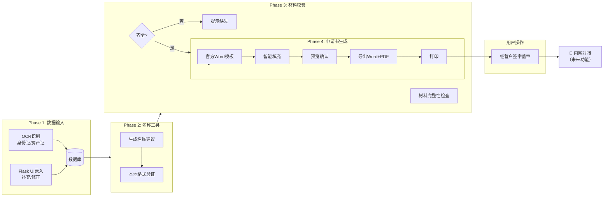

# 市场监管智能体 v5.0 - 新工作流设计文档

**版本**: 5.0
**更新日期**: 2026-01-15
**核心变更**: 移除网页自动化，专注 Phase 1-4，为内网对接做准备

---

## 📋 目录

1. [需求概述](#需求概述)
2. [新工作流设计](#新工作流设计)
3. [Phase 1-4 详细说明](#phase-1-4-详细说明)
4. [数据库优化](#数据库优化)
5. [新增模块](#新增模块)
6. [内网对接准备](#内网对接准备)
7. [下一步工作](#下一步工作)

---

## 需求概述

### 用户需求

> "phase 5 6 7不要，phase 1\2\3\4,继续开发，到申请书打印出来，因为我要经营户签字盖章的，另外，数据库的数据要全面，下一步，我要用到这些数据，对接内网。以后我有对内网网页自动化的要求。"

### 核心要点

1. ✅ **保留 Phase 1-4**: 数据输入 → 名称工具 → 材料校验 → 申请书生成
2. ❌ **移除 Phase 5-7**: 政务网填写、审核追踪、执照领取
3. ✅ **增加打印功能**: 申请书生成后打印，供经营户签字盖章
4. ✅ **数据库全面**: 完善字段，为内网对接准备
5. ✅ **预留内网接口**: 为未来内网页面自动化做准备

### 变更原因

- ❌ 网页自动化"太卡了，效率很低"
- ✅ 用户需要控制流程（签字盖章环节）
- ✅ 数据需要对接内部系统

---

## 新工作流设计

### 完整流程图



### 工作流对比

| 对比项 | 旧工作流 (v4.0) | 新工作流 (v5.0) |
|--------|----------------|----------------|
| **数据源** | OCR + 政务网 + Web表单 | OCR + Web表单 |
| **名称申报** | 政务网自动查重 | 本地验证 + 手动确认 |
| **申请书生成** | 系统生成 | 系统生成 + 打印 |
| **政务网填写** | 自动填写 | ❌ 移除 |
| **审核追踪** | 自动查询 | ❌ 移除 |
| **执照领取** | 自动下载 | ❌ 移除 |
| **内网对接** | ❌ 无 | ✅ 预留接口 |

---

## Phase 1-4 详细说明

### Phase 1: 数据输入

#### 双输入源融合

```
┌────────────────────────────────────┐
│ 输入源①: OCR识别                  │
├────────────────────────────────────┤
│ • 上传身份证照片 → 自动提取        │
│ • 上传房产证 → 提取地址信息        │
│ • 上传租赁合同 → 提取租赁信息      │
└────────────────────────────────────┘
            ↓
┌────────────────────────────────────┐
│ 输入源②: Flask Web表单             │
├────────────────────────────────────┤
│ • 手动补充缺失信息                 │
│ • 修正OCR识别错误                  │
│ • 填写完整数据                     │
└────────────────────────────────────┘
            ↓
        数据融合保存
            ↓
        ┌─────────┐
        │ 数据库  │
        └─────────┘
```

#### 数据融合优先级

**Web表单 > OCR** (Web表单数据可以覆盖OCR数据)

#### 保留的模块

- ✅ [`src/baidu_ocr_engine.py`](src/baidu_ocr_engine.py) - OCR识别引擎
- ✅ [`src/data_extractor.py`](src/data_extractor.py) - 数据提取器
- ✅ [`ui/flask_app_workflow.py`](ui/flask_app_workflow.py) - Web界面

---

### Phase 2: 名称工具

#### 本地名称验证

**新模块**: [`src/name_tools.py`](src/name_tools.py)

功能:
1. **格式验证**: 检查名称格式是否符合规范
2. **敏感词检查**: 检查是否包含禁用词
3. **本地查重**: 检查本地数据库中是否重复
4. **智能生成**: 生成10个名称建议
5. **评分排序**: 按可用性评分排序

#### 使用示例

```python
from src.name_tools import NameTools

tools = NameTools()

# 验证名称
result = tools.validate_name("玉林市兴业县张三便利店（个体工商户）")
print(f"有效: {result.is_valid}")
print(f"可信度: {result.confidence}")

# 生成建议
suggestions = tools.generate_names("张三", "便利店", "玉林市兴业县", 10)
for suggestion in suggestions:
    print(f"{suggestion.full_name} (评分: {suggestion.score})")
```

#### 名称格式规范

```
行政区划 + 字号 + 行业 + （个体工商户）
```

示例:
- 玉林市兴业县 + 张三 + 便利店 + （个体工商户）
- 南宁市青秀区 + 李四 + 餐饮店 + （个体工商户）

---

### Phase 3: 材料校验

#### 材料清单

| 材料 | 必需性 | 说明 |
|------|--------|------|
| 身份证正面 | ✅ 必需 | OCR识别 |
| 身份证反面 | ✅ 必需 | OCR识别 |
| 经营场所证明 | ✅ 必需 | 房产证或租赁合同 |
| 申请书 | ✅ 必需 | 系统生成 |

#### 校验逻辑

```python
# 当前实现
1. 检查文件是否存在
2. 验证文件格式
3. OCR识别完整性
4. 身份证格式校验
5. 地址完整性检查
```

#### 保留的模块

- ✅ [`src/material_manager.py`](src/material_manager.py) - 材料管理器

---

### Phase 4: 申请书生成

#### 新增打印功能

**新模块**: [`src/application_printer.py`](src/application_printer.py)

功能:
1. **生成Word**: 使用官方模板格式
2. **转换为PDF**: 可选功能（需额外配置）
3. **打印管理**: 记录打印次数
4. **打印状态**: 追踪打印和签字状态

#### 生成流程

```
融合数据
    ↓
应用默认值
    ↓
完整性检查
    ↓
生成Word文档
    ↓
转换为PDF (可选)
    ↓
打印
    ↓
经营户签字盖章
```

#### 使用示例

```python
from src.application_printer import ApplicationPrinter

printer = ApplicationPrinter()

# 生成申请书
result = printer.generate_application(operator_data)

print(f"文档路径: {result.document_path}")
print(f"PDF路径: {result.pdf_path}")
print(f"打印任务ID: {result.print_job_id}")

# 准备打印
print_info = printer.prepare_for_print(result.print_job_id)
print(f"打印信息: {print_info}")

# 标记已打印
printer.mark_printed(result.print_job_id, operator_data['id'])
```

---

## 数据库优化

### 新增字段列表

#### 场所信息详细字段

```sql
business_address_detail TEXT     -- 经营场所详细地址
business_area TEXT               -- 经营面积（平方米）
business_type TEXT               -- 经营类型（个体/家庭）
```

#### 经营范围细化

```sql
business_scope_licensed TEXT     -- 许可经营项目
business_scope_general TEXT      -- 一般经营项目
```

#### 从业和资金

```sql
employee_count INTEGER DEFAULT 1 -- 从业人数
registered_capital TEXT DEFAULT '0.01'  -- 注册资金（万元）
```

#### 申请书信息

```sql
application_generated BOOLEAN DEFAULT 0  -- 是否已生成申请书
application_path TEXT                   -- 申请书文件路径
application_pdf_path TEXT               -- 申请书PDF路径
application_generated_at TIMESTAMP      -- 生成时间
```

#### 打印和签字记录

```sql
printed BOOLEAN DEFAULT 0               -- 是否已打印
printed_at TIMESTAMP                    -- 打印时间
print_count INTEGER DEFAULT 0           -- 打印次数
signed BOOLEAN DEFAULT 0                -- 是否已签字盖章
signed_at TIMESTAMP                     -- 签字时间
```

#### 内网对接

```sql
intranet_synced BOOLEAN DEFAULT 0       -- 是否已同步到内网
intranet_id TEXT                        -- 内网系统ID
intranet_synced_at TIMESTAMP            -- 同步时间
intranet_sync_status TEXT               -- 同步状态
```

#### 行业分类

```sql
industry_category TEXT                  -- 行业分类代码
industry_subcategory TEXT               -- 行业子分类
```

### 数据库文件

- **定义**: [`src/database_schema_v5.py`](src/database_schema_v5.py)
- **管理**: [`src/database_manager.py`](src/database_manager.py) (保持兼容)

---

## 新增模块

### 1. 名称工具 (`src/name_tools.py`)

**功能**:
- 本地名称格式验证
- 智能名称生成
- 名称合规性检查
- 批量名称建议

**主要类**:
- `NameTools`: 名称工具主类
- `NameSuggestion`: 名称建议数据类
- `ValidationResult`: 验证结果数据类

**使用场景**:
- 经营者拟定名称时
- 需要名称建议时
- 批量查重时

---

### 2. 申请书打印工具 (`src/application_printer.py`)

**功能**:
- 生成Word申请书
- 转换为PDF（可选）
- 打印管理
- 打印记录

**主要类**:
- `ApplicationPrinter`: 打印工具主类
- `PrintJob`: 打印任务数据类
- `GenerationResult`: 生成结果数据类

**使用场景**:
- 数据准备就绪后
- 生成申请书时
- 打印申请书时
- 追踪打印状态

---

### 3. 内网对接适配器 (`src/intranet_adapter.py`)

**功能**:
- 数据同步到内网
- 同步状态管理
- 错误处理和重试
- 内网页面自动化接口（预留）

**主要类**:
- `IntranetAdapter`: 内网对接适配器
- `SyncResult`: 同步结果数据类
- `IntranetConfig`: 内网配置数据类

**预留接口**:
- `prepare_intranet_automation()`: 准备内网页面自动化
- `auto_fill_intranet_form()`: 自动填写内网表单
- `upload_materials_to_intranet()`: 上传材料到内网

**使用场景**:
- **当前**: 数据同步（模拟）
- **未来**: 内网页面自动化

---

## 内网对接准备

### 数据同步接口

#### 同步流程

```python
# 1. 创建适配器
adapter = IntranetAdapter(config)

# 2. 同步单个经营户
result = adapter.sync_operator(operator_data)

# 3. 检查结果
if result.success:
    print(f"同步成功，内网ID: {result.intranet_id}")
else:
    print(f"同步失败: {result.message}")
```

#### 数据格式转换

系统会自动将本地数据格式转换为内网格式：

```python
# 本地格式
{
    "operator_name": "张三",
    "id_card": "450...",
    "business_name": "玉林市兴业县张三便利店（个体工商户）"
}

# 转换为内网格式
{
    "operatorName": "张三",
    "idCard": "450...",
    "businessName": "玉林市兴业县张三便利店（个体工商户）"
}
```

### 内网页面自动化接口（预留）

当需要对接内网时，可以实现以下接口：

```python
# 1. 准备自动化
browser, page = adapter.prepare_intranet_automation()

# 2. 自动填写表单
adapter.auto_fill_intranet_form(operator_data, browser, page)

# 3. 上传材料
adapter.upload_materials_to_intranet(material_paths, browser, page)
```

**注意**: 这些接口当前是预留的，需要在内网对接时实现。

---

## 下一步工作

### 立即可做

1. ✅ **更新数据库**: 执行迁移脚本，添加新字段
2. ✅ **测试名称工具**: 验证名称生成和验证功能
3. ✅ **测试打印工具**: 生成并打印申请书
4. ⏳ **更新Flask应用**: 移除网页自动化相关路由

### 后续工作

1. ⏳ **完善Web界面**:
   - 添加名称工具页面
   - 添加打印管理页面
   - 优化工作流界面

2. ⏳ **实现PDF转换**:
   - 配置 docx2pdf
   - 或使用 LibreOffice 转换

3. ⏳ **内网对接**:
   - 收集内网系统API文档
   - 实现数据同步接口
   - 实现内网页面自动化

### 文件清理

需要归档的网页自动化文件：

```bash
# 创建归档目录
mkdir -p archive/web_automation_v4.0

# 移动文件
mv src/session_manager.py archive/web_automation_v4.0/
mv src/intelligent_form_filler.py archive/web_automation_v4.0/
mv src/enhanced_form_filler.py archive/web_automation_v4.0/
mv src/portal_automation.py archive/web_automation_v4.0/
mv src/portal_automation_persistent.py archive/web_automation_v4.0/
```

---

## 总结

### 核心变更

| 变更项 | 说明 |
|--------|------|
| **工作流范围** | Phase 1-4 保留，Phase 5-7 移除 |
| **数据源** | 简化为 OCR + Web表单 |
| **新增功能** | 名称工具、打印管理、内网对接 |
| **数据库** | 新增20+字段，为内网准备 |

### 技术栈

- ✅ **后端**: Flask + SQLite
- ✅ **OCR**: 百度OCR / PaddleOCR
- ✅ **文档生成**: python-docx (Jinja2)
- ✅ **打印**: 系统打印接口
- ⏳ **内网对接**: 预留接口（待实现）

### 文件清单

**新增文件**:
- [`src/database_schema_v5.py`](src/database_schema_v5.py) - v5.0数据库结构
- [`src/name_tools.py`](src/name_tools.py) - 名称工具
- [`src/application_printer.py`](src/application_printer.py) - 打印工具
- [`src/intranet_adapter.py`](src/intranet_adapter.py) - 内网对接适配器

**保留文件**:
- [`src/baidu_ocr_engine.py`](src/baidu_ocr_engine.py) - OCR引擎
- [`src/data_extractor.py`](src/data_extractor.py) - 数据提取
- [`src/database_manager.py`](src/database_manager.py) - 数据库管理
- [`jinja2_filler.py`](jinja2_filler.py) - Jinja2填充器

**待归档文件**:
- [`src/session_manager.py`](src/session_manager.py) - 会话管理器
- [`src/intelligent_form_filler.py`](src/intelligent_form_filler.py) - 智能填写器
- [`src/enhanced_form_filler.py`](src/enhanced_form_filler.py) - 增强填写器
- [`src/portal_automation.py`](src/portal_automation.py) - 门户自动化

---

**文档生成**: Claude Code (GLM-4.7)
**生成时间**: 2026-01-15
**项目版本**: v5.0
**状态**: ✅ 设计完成，等待实施
