# Office Agent Workspace - 完整架构图

**生成日期**: 2026-01-16
**版本**: v2.0 Mermaid 可视化版

---

## 🎨 系统整体架构

### 三层架构模型

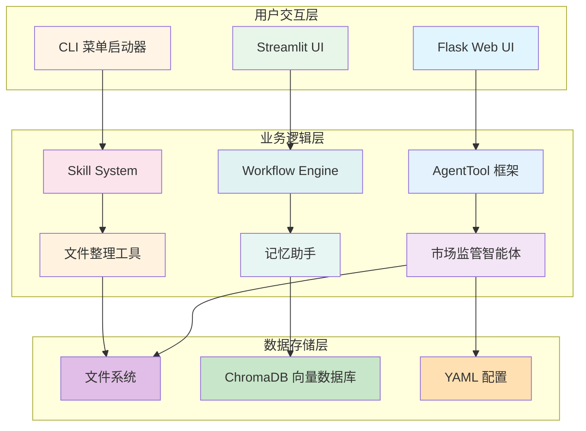

---

## 🧩 核心组件架构

### AgentTool 框架

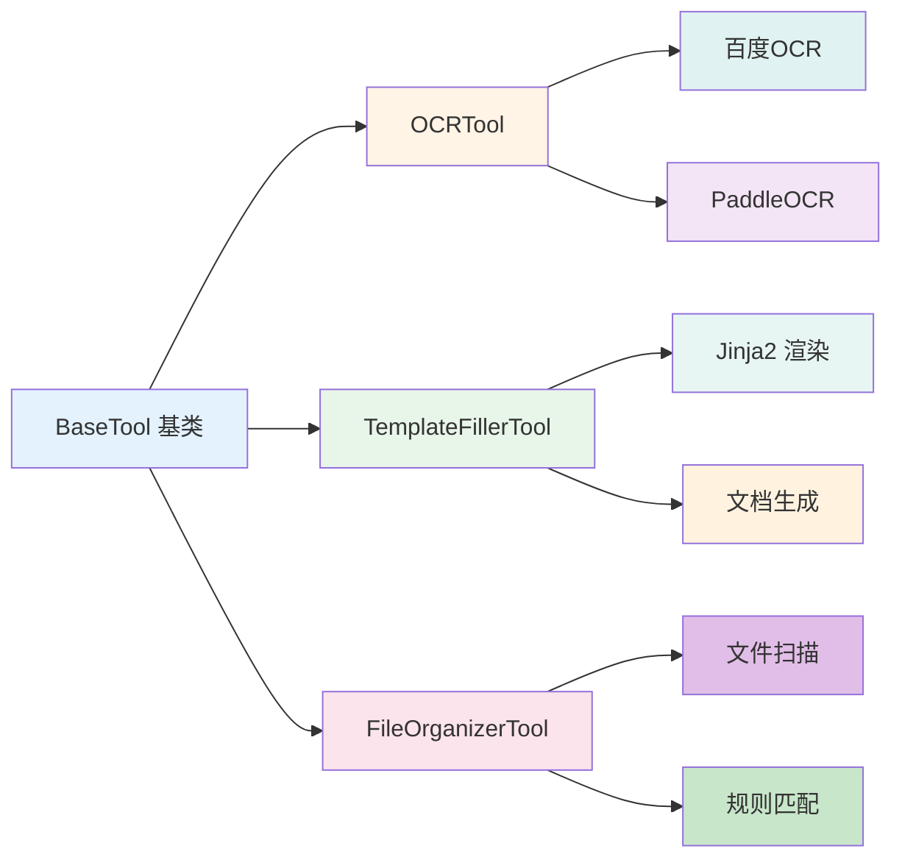

### Workflow Engine

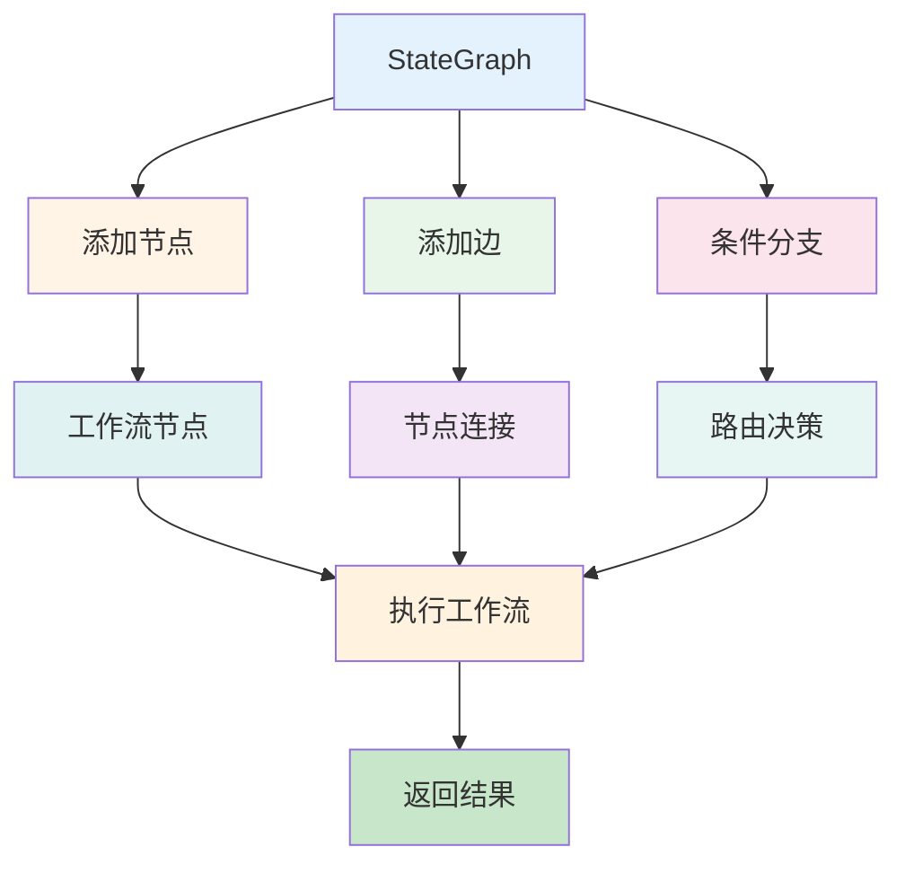

### Skill System

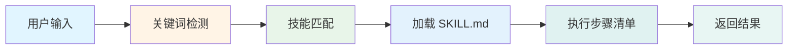

---

## 🤖 智能体详细架构

### 市场监管智能体

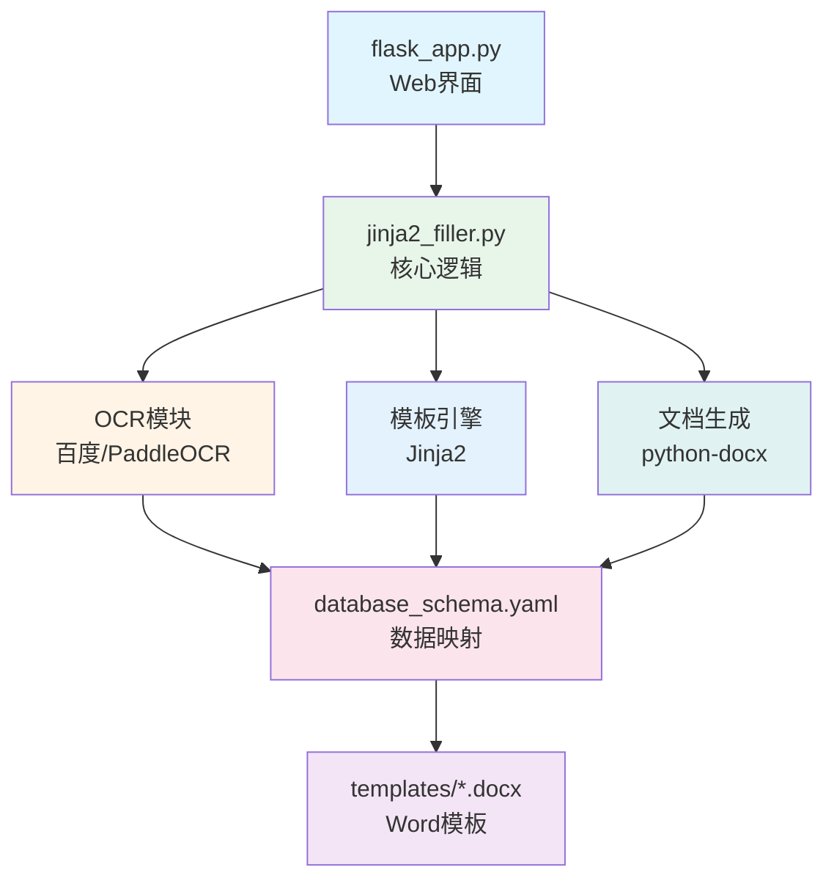

### 记忆助手

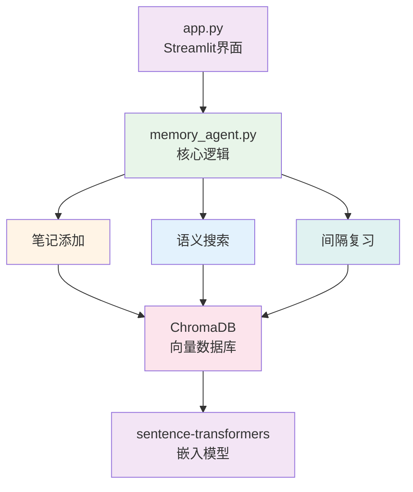

### 文件整理工具

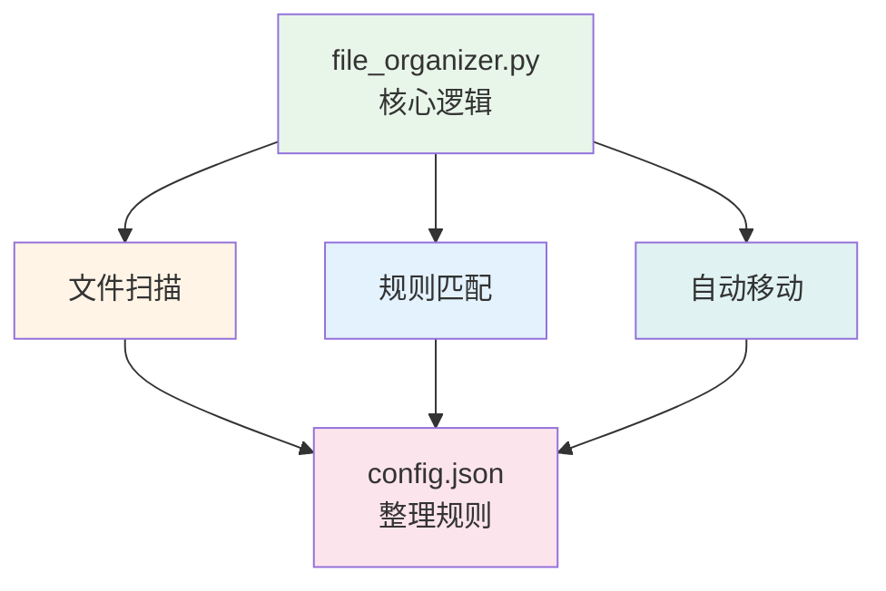

---

## 🔄 数据流设计

### 申请书生成流程

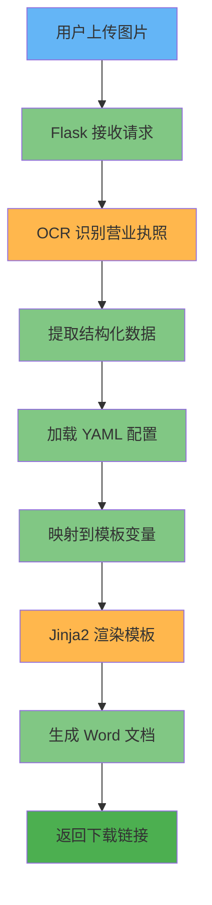

### 知识管理流程

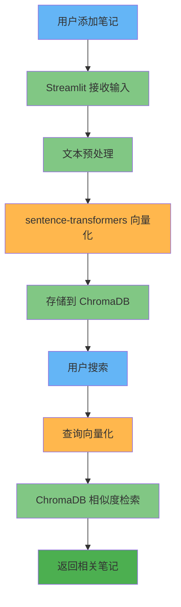

---

## 🎯 技能系统工作流

### 技能触发与执行

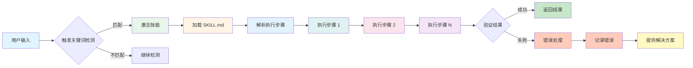

---

## 📊 技术栈关系图

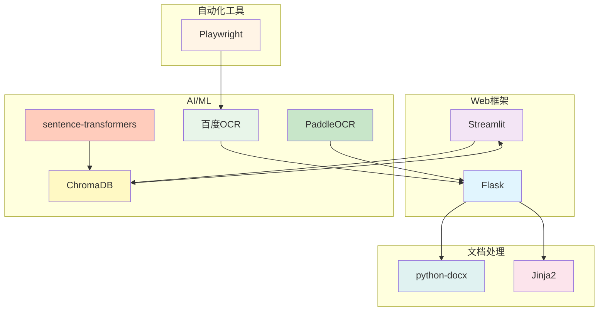

---

## 🎨 颜色主题说明

本架构图使用统一的配色方案：

| 颜色 | 色值 | 用途 |
|------|------|------|
| 🔵 蓝色 | #e1f5ff | 输入/开始 |
| 🟢 绿色 | #e8f5e9 | 成功/完成 |
| 🟡 黄色 | #fff4e6 | 处理中 |
| 🟠 橙色 | #fce4ec | 检查/验证 |
| 🟣 紫色 | #f3e5f5 | 特殊操作 |
| 🔴 红色 | #ffccbc | 错误/警告 |

---

## 📝 使用说明

### 在 VSCode 中查看

1. 安装扩展: "Mermaid Chart Preview"
2. 打开本文件
3. 查看实时渲染的流程图

### 在线查看

访问 https://mermaid.live
将 Mermaid 代码块粘贴到编辑器中

### 导出为图片

```bash
# 安装工具
npm install -g @mermaid-js/mermaid-cli

# 导出图片
mmdc -i workspace_architecture_mermaid.md -o architecture.png
```

---

**文档版本**: v2.0
**最后更新**: 2026-01-16
**维护者**: Claude Code (GLM-4.7)
