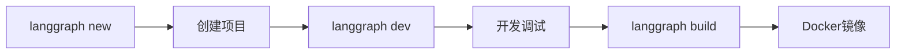

# LangGraph v0.3 深度调研报告

**调研日期**: 2026-01-15
**调研目标**: LangGraph v0.3 新功能及与工作区项目的相关性
**调研人**: Claude Code (超级管家)

---

## 📋 目录

1. [发布概览](#发布概览)
2. [核心新功能](#核心新功能)
3. [预构建Agent详解](#预构建agent详解)
4. [架构改进](#架构改进)
5. [与工作区项目的相关性](#与工作区项目的相关性)
6. [迁移建议](#迁移建议)
7. [学习资源](#学习资源)

---

## 发布概览

### 基本信息

- **发布时间**: 2025年2月27日（正式发布）/ 2025年3月1日（变更日志）
- **版本号**: v0.3.x
- **核心特性**: 预构建Agent (Prebuilt Agents)
- **支持语言**: Python & JavaScript
- **官方博客**: [LangGraph 0.3 Release: Prebuilt Agents](https://blog.langchain.com/langgraph-0-3-release-prebuilt-agents/)
- **变更日志**: [LangGraph 0.3: Pre-built agents](https://changelog.langchain.com/announcements/langgraph-0-3-pre-built-agents)

### 三大核心优势

| 优势 | 说明 |
|------|------|
| ⚡ **快速实验** | 快速启动常见Agent模式，加速原型开发 |
| 🔧 **平衡可访问性** | 更易使用，同时保持灵活性 |
| 🚀 **高效开发周期** | 更快地构建工作流 |

---

## 核心新功能

### 1. 预构建Agent (Prebuilt Agents)

LangGraph v0.3 引入了预构建的Agent库，提供开箱即用的常见模式：

#### 主要预构建组件

| 组件 | 用途 | 状态 |
|------|------|------|
| **Trustcall** | 可信执行 | ✅ 可用 |
| **Supervisor** | Agent监督模式 | ✅ 可用 |
| **LangMem** | 长期记忆Agent | ✅ 可用 |
| **Swarm** | 多Agent协调 | ✅ 可用 |

#### 代码示例 (Supervisor模式)

```python
from langgraph.prebuilt import create_supervisor

# 创建监督Agent
supervisor = create_supervisor(
    agents=[
        research_agent,
        coding_agent,
        analysis_agent
    ],
    model="gpt-4"
)

# 执行任务
result = supervisor.invoke({
    "messages": [("user", "分析最新的AI趋势")]
})
```

---

### 2. CLI增强

#### 新增模板

```bash
# 创建新项目
langgraph new my-agent --template react-agent-python

# 可用模板
- new-langgraph-project-python  # 简单聊天机器人（带记忆）
- react-agent-python            # ReAct Agent（工具集成）
- memory-agent-python           # 记忆Agent
```

#### 开发工作流



---

### 3. 状态管理改进

#### 中断与恢复 (Interrupts & Resumptions)

LangGraph v0.3 支持在执行过程中中断和恢复：

```python
# 定义可中断节点
@graph.node
interruptible_task(state: State) -> State:
    # 可以在这里中断
    interrupt()
    # 处理恢复值
    resume_value = get_resume_value()
    return state

# 执行并中断
result = graph.invoke(initial_state)

# 稍后恢复
restored = graph.resume(checkpoint_id)
```

#### 状态检查点

- 自动保存每个节点的状态快照
- 支持历史回滚
- 便于调试和审查

---

### 4. 性能优化

- **高吞吐量部署优化** - 2026年更新
- **子图组合改进** - 更灵活的图结构
- **Guardrail节点模式** - 安全性增强

---

## 预构建Agent详解

### Supervisor模式

**概念**: 一个主Agent协调多个子Agent

**架构**:
```
        ┌─────────────┐
        │ Supervisor  │
        │   Agent     │
        └──────┬──────┘
               │
      ┌────────┼────────┐
      ↓        ↓        ↓
   ┌─────┐ ┌─────┐ ┌─────┐
   │研究 │ │代码 │ │分析 │
   │Agent│ │Agent│ │Agent│
   └─────┘ └─────┘ └─────┘
```

**使用场景**:
- 复杂任务分解
- 专业领域协作
- 质量控制

**教程资源**:
- [多智能体主管 - 中文教程](https://langgraph.com.cn/tutorials/multi_agent/agent_supervisor.1.html)
- [智能体主管 - GitHub教程](https://github.langchain.ac.cn/langgraph/tutorials/multi_agent/agent_supervisor/)

### LangMem (记忆Agent)

**功能**:
- 长期记忆存储
- 上下文检索
- 重要性评分

**示例**:
```python
from langgraph.prebuilt import create_memory_agent

memory_agent = create_memory_agent(
    model="gpt-4",
    memory_store=chroma_store
)
```

### Swarm (群智模式)

**特点**:
- 多个相似Agent并行工作
- 分布式任务处理
- 自组织协作

---

## 架构改进

### 设计原则

| 原则 | 说明 |
|------|------|
| **零隐藏层** | 无强制认知架构，完全透明 |
| **精确控制** | 开发者拥有完全控制权 |
| **框架无关** | 不绑定特定LLM提供商 |

### 与工作区WorkflowEngine对比

| 特性 | LangGraph v0.3 | 工作区WorkflowEngine |
|------|----------------|---------------------|
| 状态管理 | ✅ TypedDict + Annotated | ✅ TypedDict |
| 节点系统 | ✅ 装饰器/类 | ✅ 类继承 |
| 条件边 | ✅ 原生支持 | ✅ ConditionalEdge |
| 检查点 | ✅ 自动保存 | ⚠️ 手动实现 |
| 可视化 | ✅ LangGraph Studio | ❌ 无 |
| 预构建Agent | ✅ 4+ 种类 | ❌ 需自建 |
| CLI工具 | ✅ langgraph CLI | ❌ 无 |
| 部署 | ✅ Docker/K8s | ⚠️ 需手动 |

---

## 与工作区项目的相关性

### 现有项目分析

#### 1. WorkflowEngine ([workflow_engine.py](00_Agent_Library/workflow_engine.py))

**当前实现**:
```python
class WorkflowGraph:
    def __init__(self, name: str):
        self.nodes: Dict[str, Node] = {}
        self.edges: List[Edge] = []

    def add_node(self, name: str, node: Node):
        self.nodes[name] = node

    def add_conditional_edge(self, source, condition, branches):
        # 已实现条件边
```

**与LangGraph v0.3对比**:
- ✅ **概念一致**: State、Node、Edge模型相同
- ✅ **条件路由**: ConditionalEdge已实现
- ⚠️ **缺少**: 检查点、可视化、CLI

**迁移建议**:
```python
# 可以保持当前架构，增加以下功能

# 1. 添加检查点支持
class WorkflowGraph:
    def __init__(self, name: str):
        self.checkpoints = []  # 新增

    def _save_checkpoint(self, state: State):
        self.checkpoints.append({
            "timestamp": datetime.now(),
            "state": state.copy()
        })

# 2. 添加可视化输出
def visualize_graph(graph: WorkflowGraph) -> str:
    # 生成Mermaid图表
    return mermaid_code

# 3. 保持现有API，无需重写
```

#### 2. Multi-Agent Demo ([multi_agent_demo.py](00_Agent_Library/multi_agent_demo.py))

**当前架构**:
```
Coordinator → Analyst → Processor → Reviewer
```

**升级到LangGraph v0.3 Supervisor模式**:

```python
# 方案1: 使用LangGraph v0.3 Supervisor
from langgraph.prebuilt import create_supervisor

supervisor = create_supervisor(
    agents=[
        analyst_agent,
        processor_agent,
        reviewer_agent
    ],
    model="deepseek-chat"  # 使用您的模型
)

# 方案2: 保持现有架构，增加Supervisor层
class EnhancedCoordinator(BaseAgent):
    """增强版协调者 - 使用Supervisor模式"""

    def __init__(self):
        super().__init__(
            name="enhanced_coordinator",
            role="Supervisor",
            expertise=["任务分配", "质量监控", "决策"]
        )
        self.agents = {
            "analyst": AnalystAgent(),
            "processor": ProcessorAgent(),
            "reviewer": ReviewerAgent()
        }

    def supervise(self, state: State) -> str:
        """决定下一个Agent"""
        if not state['metadata'].get('analyzed'):
            return "analyst"
        elif not state['metadata'].get('processed'):
            return "processor"
        else:
            return "reviewer"
```

### 具体改进建议

#### 改进1: 添加LangMem风格记忆

```python
# 在记忆系统中增加LangMem特性

class EnhancedMemoryAgent:
    """增强版记忆Agent - 参考LangMem"""

    def __init__(self):
        self.long_term_memory = []  # 长期记忆
        self.working_memory = {}    # 工作记忆
        self.importance_scorer = None

    def store_with_importance(self, memory: str, score: float):
        """存储带重要性评分的记忆"""
        self.long_term_memory.append({
            "content": memory,
            "importance": score,
            "timestamp": datetime.now()
        })

    def retrieve_relevant(self, query: str, top_k: int = 5):
        """检索相关记忆"""
        # 使用向量相似度
        return sorted(
            self.long_term_memory,
            key=lambda m: similarity(query, m['content']),
            reverse=True
        )[:top_k]
```

#### 改进2: 添加检查点和恢复

```python
# 在WorkflowEngine中增加

class CheckpointManager:
    """检查点管理器"""

    def save(self, workflow_id: str, state: State):
        """保存检查点"""
        checkpoint = {
            "id": str(uuid.uuid4()),
            "workflow_id": workflow_id,
            "timestamp": datetime.now().isoformat(),
            "state": state
        }
        # 保存到文件或数据库
        self.storage.append(checkpoint)
        return checkpoint['id']

    def load(self, checkpoint_id: str) -> State:
        """加载检查点"""
        checkpoint = self._find(checkpoint_id)
        return checkpoint['state']

    def list_history(self, workflow_id: str):
        """列出历史检查点"""
        return [cp for cp in self.storage
                if cp['workflow_id'] == workflow_id]
```

#### 改进3: 添加CLI工具

```python
# 创建 langgraph-cli 风格的工具

# 00_Agent_Library/workflow_cli.py

import argparse

def main():
    parser = argparse.ArgumentParser(description="工作流CLI")
    subparsers = parser.add_subparsers()

    # new 命令
    new_cmd = subparsers.add_parser("new")
    new_cmd.add_argument("path", help="项目路径")
    new_cmd.add_argument("--template", choices=["basic", "agent", "supervisor"])

    # dev 命令
    dev_cmd = subparsers.add_parser("dev")
    dev_cmd.add_argument("--watch", action="store_true")

    # build 命令
    build_cmd = subparsers.add_parser("build")

    args = parser.parse_args()
```

---

## 迁移建议

### 渐进式迁移策略

#### 阶段1: 保持兼容 (1-2周)

**目标**: 在不破坏现有代码的情况下增加功能

**行动**:
1. ✅ 保持 `workflow_engine.py` 现有API
2. ➕ 添加检查点功能
3. ➕ 添加可视化输出（Mermaid）
4. ➕ 增强记忆系统

**代码示例**:
```python
# 向后兼容的扩展

class WorkflowGraph:
    def __init__(self, name: str, enable_checkpoints: bool = True):
        # 现有代码不变
        self.name = name
        self.nodes = {}
        self.edges = []

        # 新增功能（可选）
        self.checkpoints_enabled = enable_checkpoints
        self.checkpoint_manager = CheckpointManager() if enable_checkpoints else None
```

#### 阶段2: 实验LangGraph (2-4周)

**目标**: 在新项目中尝试LangGraph v0.3

**行动**:
1. 🆕 创建示例项目使用LangGraph
2. 🆕 实现Supervisor模式Agent
3. 🆕 对比两种方案的性能
4. 📊 记录优缺点

**实验项目**:
```python
# 新项目: 01_Active_Projects/langgraph_experiment/

from langgraph.graph import StateGraph
from langgraph.prebuilt import create_supervisor

# 完全使用LangGraph v0.3
experiment_graph = StateGraph(State)
# ... 实验代码
```

#### 阶段3: 混合架构 (长期)

**目标**: 根据需求选择合适的工具

**决策矩阵**:

| 场景 | 推荐方案 | 原因 |
|------|----------|------|
| 简单工作流 | WorkflowEngine | 轻量、可控 |
| 复杂多Agent | LangGraph v0.3 | Supervisor成熟 |
| 需要可视化 | LangGraph Studio | 原生支持 |
| 快速原型 | LangGraph预构建 | 开箱即用 |
| 生产部署 | 混合使用 | 各取所长 |

---

## 学习资源

### 官方文档

| 资源 | 链接 | 说明 |
|------|------|------|
| **官方博客** | [LangGraph 0.3 Release](https://blog.langchain.com/langgraph-0-3-release-prebuilt-agents/) | 核心功能介绍 |
| **变更日志** | [Pre-built agents](https://changelog.langchain.com/announcements/langgraph-0-3-pre-built-agents) | 详细更新说明 |
| **GitHub仓库** | [langchain-ai/langgraph](https://github.com/langchain-ai/langgraph) | 源码和Issue |
| **版本说明** | [Versioning Docs](https://docs.langchain.com/oss/python/versioning) | 版本策略 |

### 中文教程

| 资源 | 链接 | 说明 |
|------|------|------|
| **Supervisor教程** | [多智能体主管](https://langgraph.com.cn/tutorials/multi_agent/agent_supervisor.1.html) | 中文文档 |
| **GitHub中文** | [智能体主管](https://github.langchain.ac.cn/langgraph/tutorials/multi_agent/agent_supervisor/) | 教程代码 |
| **深度解析** | [LangGraph 0.3 重磅发布](https://blog.csdn.net/m0_65555479/article/details/145979611) | CSDN详解 |
| **多智能体实战** | [零基础LangGraph多智能体](https://blog.csdn.net/qq_41739364/article/details/146949124) | 实战教程 |

### 视频教程

- [Build a Powerful Multi-Agent System Using LangGraph](https://www.youtube.com/watch?v=1SFZz8okqkg)

### 社区资源

- [LangGraph Release Week Recap](https://blog.langchain.com/langgraph-release-week-recap/)
- [Agent Framework Hub - 2026 Updates](https://www.agentframeworkhub.com/blog/langgraph-news-updates-2026)

---

## 总结与建议

### 关键发现

1. **LangGraph v0.3的突破**: 预构建Agent大大降低了多Agent系统开发门槛
2. **架构一致性**: 工作区WorkflowEngine的设计与LangGraph概念高度一致
3. **无需重写**: 可以通过渐进式增强保持现有代码
4. **Supervisor模式**: 特别适合工作区的多Agent协作需求

### 立即行动建议

#### ✅ 短期 (本周)

1. **增强现有系统**:
   - 添加检查点功能到 `workflow_engine.py`
   - 实现 Mermaid 可视化输出
   - 增强记忆系统（参考LangMem）

2. **学习LangGraph**:
   - 阅读官方文档
   - 跟随Supervisor教程
   - 运行示例代码

#### 🎯 中期 (本月)

1. **实验项目**:
   - 创建LangGraph实验项目
   - 对比两种方案
   - 记录性能数据

2. **决策**:
   - 评估是否迁移
   - 制定迁移计划
   - 更新相关文档

#### 🚀 长期 (持续)

1. **混合架构**:
   - 简单场景用WorkflowEngine
   - 复杂场景用LangGraph
   - 保持两者互操作性

2. **社区参与**:
   - 关注LangGraph更新
   - 贡献改进建议
   - 分享使用经验

---

## 附录

### A. 代码对比

#### WorkflowEngine vs LangGraph

```python
# 工作区方式 (WorkflowEngine)
from workflow_engine import WorkflowGraph, Node, State

graph = WorkflowGraph("my_workflow")
graph.add_node("process", ProcessNode())
graph.add_edge("start", "process")
workflow = graph.compile()

# LangGraph v0.3方式
from langgraph.graph import StateGraph

graph = StateGraph(State)
graph.add_node("process", process_node)
graph.add_edge("start", "process")
compiled = graph.compile()
```

### B. 安装指南

```bash
# 安装LangGraph
pip install langgraph

# 或使用工作区虚拟环境
./venv_py312/Scripts/pip install langgraph

# 安装CLI工具
npm install -g @langchain/langgraph-cli

# 验证安装
langgraph --version
python -c "import langgraph; print(langgraph.__version__)"
```

---

**报告完成时间**: 2026-01-15 16:25
**下次更新时间**: 根据LangGraph新版本发布
**相关文件**: [workflow_engine.py](00_Agent_Library/workflow_engine.py), [multi_agent_demo.py](00_Agent_Library/multi_agent_demo.py)
