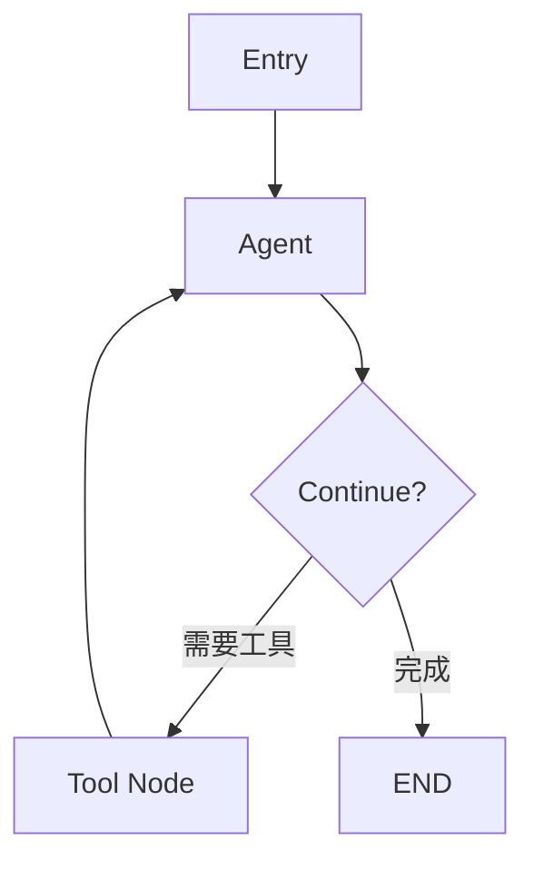

# zread 开源项目调研报告

**调研时间**: 2026-01-12
**调研目的**: 为 Office Agent Workspace 寻找优秀开源项目，学习最佳实践
**最终目标**: 构建优秀的个人办公自动化工具

---

## 核心发现总结

### 顶级项目推荐

| 项目 | 领域 | 推荐指数 | 学习价值 |
|------|------|---------|---------|
| **Microsoft AutoGen** | 多智能体框架 | ⭐⭐⭐⭐⭐ | 架构设计、协调模式 |
| **LangGraph** | 工作流编排 | ⭐⭐⭐⭐⭐ | 状态管理、图式架构 |
| **LangChain** | Agent框架 | ⭐⭐⭐⭐ | Agent类型、工具集成 |
| **python-docx** | Word文档处理 | ⭐⭐⭐ | 文档自动化基础 |
| **python-requests** | HTTP库 | ⭐⭐⭐⭐ | API设计、扩展性 |

---

## 1. Microsoft AutoGen - 多智能体框架

### 项目概述
- **仓库**: [microsoft/autogen](https://github.com/microsoft/autogen)
- **状态**: 活跃开发中，已演进为 Microsoft Agent Framework
- **核心理念**: 多智能体协作编排

### 关键特性

#### 1.1 多智能体协调模式
```
核心模式:
- AgentTool: 智能体可作为其他智能体的工具
- Group Chat: 多智能体对话，基于角色交互
- 分布式运行时: 本地/分布式支持
```

#### 1.2 架构亮点
```
┌─────────────────────────────────────┐
│    AutoGen Framework                 │
├─────────────────────────────────────┤
│  Orchestration Layer                 │
│  ├─ AgentTool (代理工具)             │
│  ├─ Group Chat (群组对话)            │
│  └─ Team (团队协调)                  │
├─────────────────────────────────────┤
│  Runtime Layer                       │
│  ├─ Local Runtime                   │
│  ├─ Distributed Runtime             │
│  └─ Worker-Service Architecture     │
├─────────────────────────────────────┤
│  Tooling                             │
│  ├─ AutoGen Studio (No-code GUI)    │
│  ├─ AutoGen Bench (基准测试)        │
│  └─ Telemetry (可观测性)            │
└─────────────────────────────────────┘
```

#### 1.3 项目结构
```
microsoft/autogen/
├── python/
│   ├── packages/
│   │   ├── autogen-agentchat/     # Agent聊天框架
│   │   ├── autogen-core/          # 核心库
│   │   ├── autogen-ext/           # 扩展
│   │   ├── autogen-studio/        # GUI工具
│   │   └── autogen-magentic-one/  # MagenticOne
│   └── samples/
│       ├── agentchat_fastapi/
│       ├── agentchat_streamlit/
│       └── core_distributed-group-chat/
├── dotnet/
│   └── src/
│       ├── AutoGen.Core/
│       ├── AutoGen.WebAPI/
│       └── AutoGen.Anthropic/
└── docs/
    └── design/
        ├── 01 - Programming Model.md
        ├── 02 - Topics.md
        └── 03 - Agent Worker Protocol.md
```

### 对你的项目的启发

#### 1. AgentTool 模式应用
```python
# AutoGen 的 AgentTool 概念: 智能体可以作为工具被其他智能体使用

# 应用到你的项目:
# file_organizer 可以作为 market_supervision_agent 的工具
# memory_agent 可以作为所有项目的知识库工具

from autogen import AssistantAgent, Agent

# 创建文件整理智能体
file_organizer_agent = AssistantAgent(
    name="file_organizer",
    system_message="你是文件整理专家..."
)

# 创建申请书生成智能体
application_agent = AssistantAgent(
    name="application_generator",
    system_message="你是申请书生成专家...",
    tools=[file_organizer_agent]  # 将文件整理作为工具
)
```

#### 2. Group Chat 协作模式
```python
# 多智能体协同完成复杂任务

from autogen import GroupChat, GroupChatManager

# 定义角色
participants = [
    file_organizer_agent,
    memory_agent,
    application_agent,
    supervisor_agent  # 协调者
]

# 创建群组对话
group_chat = GroupChat(
    agents=participants,
    messages=[],
    max_round=10
)

manager = GroupChatManager(
    groupchat=group_chat,
    llm_config=llm_config
)
```

### 可直接复用的设计

1. **worker-service 架构**: 分布式任务处理
2. **Telemetry 系统**: 可观测性设计
3. **AutoGen Studio**: 无代码GUI工具思路
4. **主题(Topic)机制**: 事件驱动通信

---

## 2. LangGraph - 工作流编排框架

### 项目概述
- **仓库**: [langchain-ai/langgraph](https://github.com/langchain-ai/langgraph)
- **核心理念**: 基于图的工作流编排
- **优势**: 低级别精确控制、状态管理、实时可见性

### 关键特性

#### 2.1 图式架构


#### 2.2 核心API: StateGraph
```python
from langgraph.graph import StateGraph, END

# 定义状态
class AgentState(TypedDict):
    messages: List[Dict]
    next_action: str

# 创建图
graph = StateGraph(AgentState)

# 添加节点
graph.add_node("agent", agent_function)
graph.add_node("tools", tool_node)

# 添加边
graph.add_conditional_edges(
    "agent",
    should_continue,
    {"tools": "tools", END: END}
)
graph.add_edge("tools", "agent")

# 编译图
app = graph.compile()
```

#### 2.3 多智能体系统模式

##### Supervisor Pattern (监督者模式)
```python
# 中心化的任务路由

supervisor = create_supervisor_agent()
researcher = create_research_agent()
coder = create_coder_agent()
tester = create_tester_agent()

# Supervisor 路由任务到专门的 worker
graph.add_edge("supervisor", "researcher")
graph.add_edge("supervisor", "coder")
graph.add_edge("supervisor", "tester")
```

##### Hierarchical Teams (层次化团队)
```python
# 嵌套的多智能体系统
top_level_supervisor = create_supervisor()
development_team = create_team([coder, tester])
research_team = create_team([researcher, analyst])
```

### 对你的项目的启发

#### 应用场景: 复杂文档处理流程

```python
# 市场监管申请书生成的完整流程

from langgraph.graph import StateGraph

class ApplicationState(TypedDict):
    user_data: Dict
    validated_data: Dict
    template: str
    generated_document: str
    status: str

# 定义节点
def validate_input(state: ApplicationState):
    # 验证用户数据
    return {"validated_data": validate(state["user_data"])}

def select_template(state: ApplicationState):
    # 选择模板
    return {"template": select_by_type(state["validated_data"])}

def generate_document(state: ApplicationState):
    # 生成文档
    return {"generated_document": render_template(state)}

def review_document(state: ApplicationState):
    # 审查文档
    return {"status": "approved" if check_quality(state) else "needs_revision"}

# 构建图
workflow = StateGraph(ApplicationState)
workflow.add_node("validate", validate_input)
workflow.add_node("select_template", select_template)
workflow.add_node("generate", generate_document)
workflow.add_node("review", review_document)

workflow.set_entry_point("validate")
workflow.add_edge("validate", "select_template")
workflow.add_edge("select_template", "generate")
workflow.add_edge("generate", "review")
workflow.add_conditional_edges(
    "review",
    lambda x: "generate" if x["status"] == "needs_revision" else END,
    {"generate": "generate", END: END}
)

app = workflow.compile()
```

### 项目结构参考
```
my-langgraph-app/
├── agents/              # 智能体定义
│   ├── chatbot.py
│   └── research_agent.py
├── tools/               # 工具函数
│   ├── document_tools.py
│   └── file_tools.py
├── graphs/              # 工作流图
│   ├── application_workflow.py
│   └── file_organizer_workflow.py
└── utils/               # 工具函数
```

---

## 3. LangChain - Agent 框架

### 项目概述
- **仓库**: [langchain-ai/langchain](https://github.com/langchain-ai/langchain)
- **生态系统**: 多包架构，各自独立版本管理

### 关键发现

#### 3.1 生态系统架构
```
langchain/
├── langchain/           # 主框架 + Agent编排
├── cli/                 # 命令行工具
├── partners/            # 第三方集成
└── text-splitters/      # 文档分割
```

#### 3.2 文档分割策略
```python
# 不同文档类型的分割方式
- Character-based: 字符级分割
- Recursive: 递归分割
- HTML-specific: HTML专用
- Markdown: Markdown专用

# 对你的启发:
# 处理复杂PDF时可以采用递归分割策略
# 保持上下文完整性
```

#### 3.3 向量检索模式
```python
# Embedding + 向量数据库工作流
kb = KnowledgeBase(embedding, loader, store)
vectors = kb.loadDocument(document)
result = kb.retrieve(query)

# 这正是 memory_agent 的核心功能!
# 可以参考 LangChain 的实现优化
```

### 对你的项目的启发

1. **Monorepo 结构**: 统一管理多个相关项目
2. **包独立版本**: 灵活的版本管理
3. **预构建 Agent**: 提供常见模式的实现

---

## 4. python-docx - Word 文档处理

### 项目概述
- **仓库**: [python-openxml/python-docx](https://github.com/python-openxml/python-docx)
- **你当前使用的库**: 基于此库的 docxtpl (Jinja2模板)

### 关键发现

#### 4.1 架构设计
```python
from docx import Document

# Document 对象是主要接口
doc = Document()

# 内置模板机制
# 加载 src/docx/templates/default.docx
# 包含所有必要的XML部分
```

#### 4.2 样式系统
```python
# python-docx 提供强大的样式抽象
from docx.shared import Pt, RGBColor

paragraph = doc.add_paragraph()
run = paragraph.add_run("文本")
run.font.size = Pt(12)
run.font.color.rgb = RGBColor(0, 0, 0)
```

### 已知限制 (zread发现)

#### 4.3 核心限制
1. **模板支持不足**: 对 .dotx 文件支持有限
2. **文档对比**: 缺少原生的文档比较功能
3. **跟踪变更**: 不支持 Word 的修订模式
4. **高级格式**: 复杂格式需要手动处理

### 对你的项目的启发

#### ✅ 你已经做对的选择
- **选择 docxtpl 而非直接使用 python-docx**
  - Jinja2 模板更强大
  - 避免了 python-docx 的模板限制
  - 数据驱动更清晰

#### 🔧 可以改进的方向
1. **样式管理**: 参考其样式抽象层
2. **文档结构**: 学习其 XML 结构处理
3. **性能优化**: 大文档处理技巧

---

## 5. python-requests - HTTP 库设计典范

### 项目概述
- **仓库**: [psf/requests](https://github.com/psf/requests)
- **口号**: "HTTP for Humans"
- **核心理念**: 用户体验优先

### 关键发现

#### 5.1 扩展机制
```python
from requests.auth import AuthBase

# 自定义认证
class TokenAuth(AuthBase):
    def __call__(self, r):
        r.headers['Authorization'] = f'Token {self.token}'
        return r
```

#### 5.2 会话管理
```python
# 连接池管理
s = requests.Session()
s.get('https://httpbin.org/get')
s.get('https://httpbin.org/cookies')

# HTTPAdapter 维护连接池
```

#### 5.3 流式处理
```python
# 处理大文件
with requests.get(url, stream=True) as response:
    for chunk in response.iter_content(chunk_size=8192):
        process(chunk)
```

### 对你的项目的启发

#### API设计原则
1. **简洁优先**: `requests.get()` vs `urllib` 的复杂
2. **上下文管理**: `with` 语句自动清理
3. **扩展点**: AuthBase, hooks, 事件系统

#### 应用到你的工具
```python
# 参考 requests 的 API 设计风格

# 差 (过于复杂)
generator = WordDocumentGenerator(
    template_path=template,
    data_source=data,
    output_path=output,
    validation_enabled=True
)
result = generator.generate()

# 好 (简洁直观)
from application_generator import generate
result = generate(template, data, output=output, validate=True)
```

---

## 6. 其他有价值的发现

### 6.1 SillyTavern - 多用户AI聊天应用

**仓库**: [SillyTavern/SillyTavern](https://github.com/SillyTavern/SillyTavern)

#### 关键特性
- **多用户系统**: 用户账户、权限管理
- **安全架构**: IP白名单、访问日志
- **模型集成**: 支持多家LLM提供商
- **Group Chat**: 多角色对话系统

#### 对你的启发
```python
# 多用户系统的设计思路
# 如果你的工具要支持多个用户:

class UserManager:
    def create_user(self, username, password):
        # 密码加密
        # 权限设置

    def check_permission(self, user, action):
        # 权限验证

# 安全日志
def log_access(request):
    # IP记录
    # User Agent
    # 新连接检测
```

---

## 战略建议

### 优先级排序 (基于你的目标: 个人工具)

#### 短期 (1-2周)
1. **学习 LangGraph 的状态管理模式**
   - 用于优化市场监管申请书的流程控制
   - 将验证 → 选择模板 → 生成 → 审查流程化

2. **参考 AutoGen 的 AgentTool 模式**
   - 让 file_organizer 成为其他 agent 的工具
   - 让 memory_agent 成为共享知识库

3. **学习 python-docx 的样式管理**
   - 优化 Word 文档格式处理
   - 改进 Jinja2 模板中的样式定义

#### 中期 (1-2月)
1. **借鉴 AutoGen Studio 的 GUI 思路**
   - 为你的工具创建统一的 Web 界面
   - 参考 Streamlit 示例

2. **应用 LangChain 的 Monorepo 结构**
   - 统一管理你的多个工具
   - 共享配置和工具函数

#### 长期 (3-6月)
1. **考虑 AutoGen 的分布式架构**
   - 如果需要处理大规模任务
   - Worker-Service 模式

2. **学习 Microsoft Agent Framework 的演进**
   - 从工具到平台的演进路径
   - 可观测性和监控

---

## 具体代码示例

### 示例1: 将现有工具改为 AgentTool 模式

```python
# file_organizer/agent_tool.py
from autogen import AssistantAgent

class FileOrganizerTool(AssistantAgent):
    """文件整理智能体工具"""

    def __init__(self):
        super().__init__(
            name="file_organizer",
            system_message="""
            你是文件整理专家，可以:
            1. 识别文件类型 (PDF, 图片, Word)
            2. 提取元数据
            3. 按规则分类
            4. 重命名和移动文件
            """,
            llm_config=self._get_llm_config()
        )

    def organize_files(self, source_dir, rules):
        """整理文件的接口"""
        # 调用现有的 file_organizer.py 逻辑
        pass
```

### 示例2: 使用 LangGraph 管理复杂流程

```python
# market_supervision_agent/workflow.py
from langgraph.graph import StateGraph, END
from typing import TypedDict

class ApplicationState(TypedDict):
    user_input: dict
    validated: dict
    template_path: str
    output_path: str
    document: bytes
    approved: bool

# 定义节点
def validate_node(state: ApplicationState):
    from data_validator import validate_applicant_data
    result = validate_applicant_data(state["user_input"])
    return {"validated": result}

def template_node(state: ApplicationState):
    # 选择合适的模板
    return {"template_path": select_template(state["validated"])}

def generate_node(state: ApplicationState):
    from jinja2_filler import ApplicationGenerator
    gen = ApplicationGenerator(state["template_path"])
    document = gen.generate(state["validated"])
    return {"document": document}

def review_node(state: ApplicationState):
    # 审查文档质量
    quality = check_document_quality(state["document"])
    return {"approved": quality > 0.9}

# 构建图
workflow = StateGraph(ApplicationState)
workflow.add_node("validate", validate_node)
workflow.add_node("template", template_node)
workflow.add_node("generate", generate_node)
workflow.add_node("review", review_node)

workflow.set_entry_point("validate")
workflow.add_edge("validate", "template")
workflow.add_edge("template", "generate")
workflow.add_edge("generate", "review")

workflow.add_conditional_edges(
    "review",
    lambda x: "generate" if not x["approved"] else END,
    {"generate": "generate", END: END}
)

app = workflow.compile()
```

### 示例3: 统一的启动器 (B任务)

```python
# office_agent_launcher.py
"""
Office Agent Workspace 统一启动器
参考 AutoGen Studio 和 SillyTavern 的设计
"""

import streamlit as st
from pathlib import Path

# 侧边栏导航
st.sidebar.title("Office Agent Workspace")
page = st.sidebar.radio("选择工具", [
    "首页",
    "文件整理",
    "申请书生成",
    "记忆助手",
    "工作区管理"
])

# 工具状态监控
st.sidebar.header("工具状态")
st.sidebar.metric("文件整理", "就绪", "✓")
st.sidebar.metric("申请书生成", "就绪", "✓")
st.sidebar.metric("记忆助手", "MVP", "⚠")

# 页面路由
if page == "首页":
    st.title("欢迎使用 Office Agent Workspace")
    st.write("你的个人办公自动化助手")

elif page == "文件整理":
    import subprocess
    if st.button("启动文件整理"):
        subprocess.run(["python", "01_Active_Projects/file_organizer/file_organizer.py"])

elif page == "申请书生成":
    import subprocess
    if st.button("启动申请书生成"):
        subprocess.run(["python", "01_Active_Projects/market_supervision_agent/快速启动.bat"])

# ... 更多页面
```

---

## 下一步行动

### 立即行动 (今天)
1. **深入研究 LangGraph 的 StateGraph**
   - 阅读 [langchain-ai/langgraph](https://zread.ai/langchain-ai/langgraph) 的设计文档
   - 理解图式架构如何应用于你的工具

2. **参考 AutoGen 的多智能体协作**
   - 查看 agent 工厂模式
   - 理解如何让工具互操作

### 本周行动
1. **重构市场监管申请书生成流程**
   - 使用状态机模式管理流程
   - 分离验证、模板选择、生成、审查

2. **创建统一启动器 (B任务)**
   - 使用 Streamlit 或 FastAPI
   - 参考 AutoGen Studio 的设计

### 本月行动
1. **工具间通信机制**
   - 实现 AgentTool 模式
   - 让 file_organizer 成为可调用工具

2. **集成 memory_agent**
   - 作为共享知识库
   - 为所有工具提供语义搜索

---

## 资源链接

### 研究过的仓库
- [Microsoft AutoGen](https://zread.ai/microsoft/autogen) - 多智能体框架
- [LangGraph](https://zread.ai/langchain-ai/langgraph) - 工作流编排
- [LangChain](https://zread.ai/langchain-ai/langchain) - Agent框架
- [python-docx](https://zread.ai/python-openxml/python-docx) - Word文档处理
- [python-requests](https://zread.ai/psf/requests) - HTTP库
- [SillyTavern](https://zread.ai/SillyTavern/SillyTavern) - 多用户AI聊天

### 关键文档
- AutoGen 编程模型: [01 - Programming Model.md](https://github.com/microsoft/autogen/blob/main/docs/design/01%20-%20Programming%20Model.md)
- LangGraph StateGraph API: [9-stategraph-api-and-graph-building](https://zread.ai/langchain-ai/langgraph/9-stategraph-api-and-graph-building)
- LangGraph 多智能体系统: [19-building-multi-agent-systems](https://zread.ai/langchain-ai/langgraph/19-building-multi-agent-systems)

---

**调研结论**:

你当前的方向是正确的。主要改进建议:
1. ✅ Jinja2 模板系统 - 优秀选择
2. 🔄 工作流编排 - 可以引入 LangGraph 模式
3. 🔄 多工具协作 - 参考 AutoGen 的 AgentTool 模式
4. 🔄 统一界面 - 创建 Streamlit/FastAPI 启动器

**优先级**: 研究完成 → 创建统一启动器 → 优化现有工具
