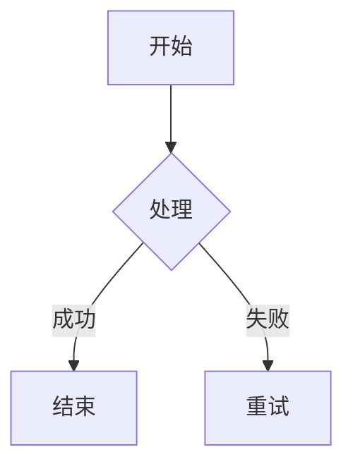
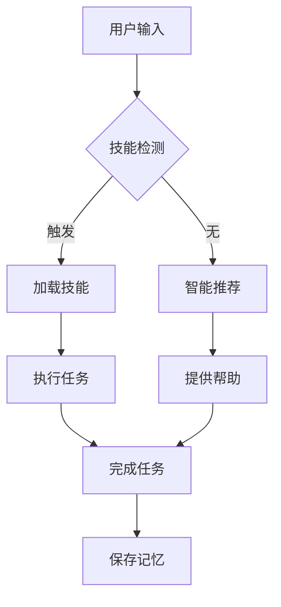

# 🎨 流程图工具推荐与对比

**更新日期**: 2026-01-16
**用途**: 为工作区创建更精美、直观的流程图

---

## 🏆 推荐工具排行榜

### 1️⃣ **Mermaid** ⭐ 最推荐

**类型**: 文本到图表工具
**语言**: Markdown-like 语法
**特点**:
- ✅ 纯文本定义，版本控制友好
- ✅ 支持多种图表（流程图、序列图、甘特图等）
- ✅ 实时渲染，所见即所得
- ✅ VSCode 原生支持
- ✅ Python 集成 (mmdc, mermaid-py)

**适用场景**:
- 技术文档流程图
- 系统架构图
- 快速原型设计

**安装**:
```bash
pip install mermaid-py  # Python库
# VSCode扩展: Mermaid Chart
```

**示例**:


**资源**:
- [GitHub - mermaid-js/mermaid](https://github.com/mermaid-js/mermaid)
- [VSCode扩展](https://marketplace.visualstudio.com/items?itemName=MermaidChart.vscode-mermaid-chart)
- [Python库 - mermaid-py](https://github.com/ouhammmourachid/mermaid-py)

---

### 2️⃣ **Diagrams** ⭐ Python原生

**类型**: Python 代码绘图库
**语言**: Python API
**特点**:
- ✅ 纯 Python 代码定义
- ✅ 支持 AWS/Azure/GCP 架构图
- ✅ 自动布局算法
- ✅ 导出多种格式

**安装**:
```bash
pip install diagrams
```

**示例**:
```python
from diagrams import Diagram
from diagrams.aws.compute import EC2

with Diagram("Web Service", show=False):
    EC2("Web Server")
```

**资源**:
- [GitHub - diagrams](https://github.com/mingrammer/python-diagrams)
- [官方文档](https://diagrams.mingrammer.com/)

---

### 3️⃣ **Graphviz** ⭐ 学术标准

**类型**: 图可视化工具
**语言**: DOT 语言
**特点**:
- ✅ 学术界标准
- ✅ 强大的布局算法
- ✅ Python 绑定
- ✅ 支持复杂图表

**安装**:
```bash
pip install graphviz
# 需要安装 Graphviz 软件
```

**示例**:
```python
from graphviz import Digraph

dot = Digraph()
dot.node('A', '开始')
dot.node('B', '处理')
dot.edge('A', 'B')
dot.render('output', view=True)
```

**资源**:
- [Graphviz官网](https://graphviz.org/)
- [Python Graphviz 教程](https://www.cnblogs.com/marsggbo/p/10327618.html)

---

### 4️⃣ **PlantUML** ⭐ UML专家

**类型**: UML 专用工具
**语言** PlantUML 语法
**特点**:
- ✅ UML 标准实现
- ✅ 支持所有 UML 图类型
- ✅ 代码反向工程
- ✅ VSCode 集成

**安装**:
```bash
pip install plantuml
# VSCode扩展: PlantUML
```

**示例**:
```plantuml
@startuml
Actor User
Participant "Claude Code"

User -> Claude Code: 发送消息
Claude Code -> User: 返回结果
@enduml
```

**资源**:
- [PlantUML官网](https://plantuml.com/)
- [VSCode扩展](https://medium.com/@NeroHin/plantuml-%25E6%2595%25B4%25E5%2590%2588-vscode-%25E6%258F%2592%25E4%25BB%25B6%25E6%2595%2599%25E5%25AD%25B8%25E8%2588%2587%25E5%25B8%25B8%25E8%25A6%258B-uml-%25E5%259C%2596%25E4%25BE%258B%25E7%25B7%25B4%25E7%25BF%2592-1fc2b689e183)

---

### 5️⃣ **Draw.io (Diagrams.net)** ⭐ 最灵活

**类型**: 可视化编辑器
**特点**:
- ✅ 拖拽式界面
- ✅ 丰富的模板库
- ✅ 导入/导出多种格式
- ✅ 在线协作

**资源**:
- [在线版](https://app.diagrams.net/)
- [桌面版](https://github.com/jgraph/drawio-desktop)
- [VSCode集成](https://www.cnblogs.com/xgqfrms/p/14645636.html)

**Python集成**:
- XML 格式解析
- 程序化生成图表

---

## 🎯 工具对比表

| 工具 | 难度 | 美观度 | 自动化 | Python | 版本控制 | 推荐场景 |
|------|------|--------|--------|--------|----------|---------|
| **Mermaid** | ⭐⭐⭐ | ⭐⭐⭐⭐ | ⭐⭐⭐⭐ | ✅ | ✅ | 技术文档 |
| **Diagrams** | ⭐⭐⭐ | ⭐⭐⭐⭐ | ⭐⭐⭐⭐ | ✅ | ✅ | 架构图 |
| **Graphviz** | ⭐⭐⭐⭐ | ⭐⭐⭐ | ⭐⭐ | ✅ | ✅ | 学术论文 |
| **PlantUML** | ⭐⭐⭐⭐ | ⭐⭐⭐ | ⭐⭐⭐ | ✅ | ✅ | UML设计 |
| **Draw.io** | ⭐⭐ | ⭐⭐⭐⭐ | ⭐⭐ | ❌ | ❌ | 商业演示 |

---

## 🚀 Python 集成方案

### 方案1: Mermaid + mmdc ⭐ 推荐

```bash
# 安装
pip install mmdc

# 生成流程图
mmdc render input.mmd -o output.png
```

**优势**:
- Markdown 原生支持
- VSCode 实时预览
- CLI 批量生成

### 方案2: Diagrams 纯 Python

```python
# 安装
pip install diagrams

# 代码生成
from diagrams import Diagram
with Diagram("工作区架构"):
    # 定义架构
```

### 方案3: Graphviz 高级定制

```python
# 安装
pip install graphviz

# 编程生成
from graphviz import Digraph
dot = Digraph(comment='工作区流程')
# 添加节点和边
```

---

## 💡 推荐组合

### 组合A: 技术文档

**Mermaid** (流程图) + **mmdc** (生成工具)
- 用于 CLAUDE.md
- 用于技能文档
- 用于开发指南

### 组合B: 架构图

**Diagrams** (Python) + **Graphviz** (渲染)
- 系统架构图
- 部署架构图
- 数据流图

### 组合C: UML设计

**PlantUML** (UML) + **Mermaid** (流程图)
- 类图
- 序列图
- 状态图

---

## 🛠️ 工作区应用建议

### 1. 替换现有 ASCII 流程图

**当前**: 文本框字符画
```
┌─────┐
│ 开始 │
└─────┘
```

**升级为 Mermaid**:


### 2. 创建工作区可视化工具

**功能**:
```python
# tools/diagram_generator.py
from diagrams import Diagram

def generate_workspace_diagram():
    with Diagram("Office Agent Workspace"):
        # 自动生成架构图
```

### 3. 集成到文档生成流程

```python
# 自动为 README.md 生成流程图
# 自动为 SKILL.md 生成执行步骤图
# 自动为 ARCHITECTURE.md 生成架构图
```

---

## 📦 快速开始

### 安装核心工具

```bash
# Mermaid (文本到图表)
pip install mermaid-py

# Diagrams (Python 代码绘图)
pip install diagrams

# Graphviz (图可视化)
pip install graphviz
```

### VSCode 扩展

```bash
# Mermaid Chart (预览 + 导出)
# PlantUML (UML 专业工具)
# Draw.io Integration (可视化编辑)
```

---

## 🎨 效果对比

### ASCII 流程图 (当前)
```
┌─────────────┐
│  用户输入   │
└──────┬──────┘
       ↓
┌─────────────┐
│  技能检测   │
└──────┬──────┘
```

### Mermaid 流程图 (升级后)


---

## 📊 选型指南

| 需求 | 推荐工具 | 原因 |
|------|---------|------|
| 技术文档 | Mermaid | Markdown原生，版本控制 |
| 系统架构 | Diagrams | Python原生，云图标 |
| UML设计 | PlantUML | 标准实现，代码反向工程 |
| 学术论文 | Graphviz | 布局最优，PDF导出 |
| 商业演示 | Draw.io | 美观专业，模板丰富 |
| 快速原型 | Mermaid | 简单快速，实时预览 |

---

## 🔗 相关资源

**Mermaid**:
- [官方文档](https://mermaid.js.org/intro/)
- [Python库](https://github.com/ouhammmourachid/mermaid-py)
- [VSCode扩展](https://marketplace.visualstudio.com/items?itemName=MermaidChart.vscode-mermaid-chart)

**Diagrams**:
- [GitHub](https://github.com/mingrammer/python-diagrams)
- [官方文档](https://diagrams.mingrammer.com/)

**Graphviz**:
- [官网](https://graphviz.org/)
- [Python教程](https://www.cnblogs.com/marsggbo/p/10327618.html)

**PlantUML**:
- [官网](https://plantuml.com/)
- [VSCode教程](https://medium.com/@NeroHin/plantuml-%25E6%2595%25B4%25E5%2590%2588-vscode-%25E6%258F%2592%25E4%25BB%25B6%25E6%2595%2599%25E5%25AD%25B8%25E8%2588%2587%25E5%25B8%25B8%25E8%25A6%258B-uml-%25E5%259C%2596%25E4%25BE%258B%25E7%25B7%25B4%25E7%25BF%2592-1fc2b689e183)

**Draw.io**:
- [在线版](https://app.diagrams.net/)
- [桌面版](https://github.com/jgraph/drawio-desktop)
- [VSCode集成](https://www.cnblogs.com/xgqfrms/p/14645636.html)

**Python代码转流程图**:
- [pycallgraph](https://juejin.cn/post/6844904200460042254)
- [Pyreverse](https://developer.aliyun.com/article/1310216)

---

**总结**:
- **日常使用**: Mermaid (文本到图表)
- **架构图**: Diagrams (Python 代码)
- **专业文档**: PlantUML (UML标准)
- **学术论文**: Graphviz (PDF输出)
- **快速原型**: Mermaid (实时预览)

---

*由 GLM-4.7 (Claude Code) 整理*
*2026-01-16*
