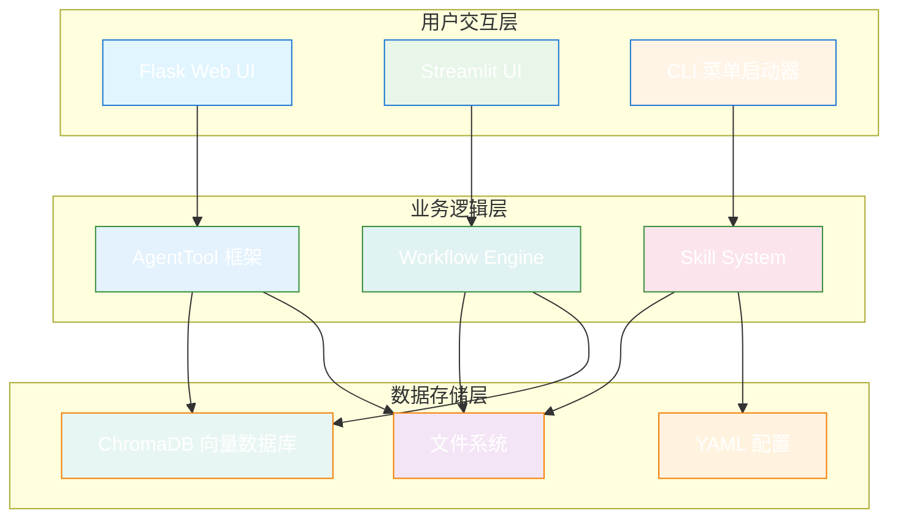
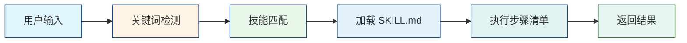
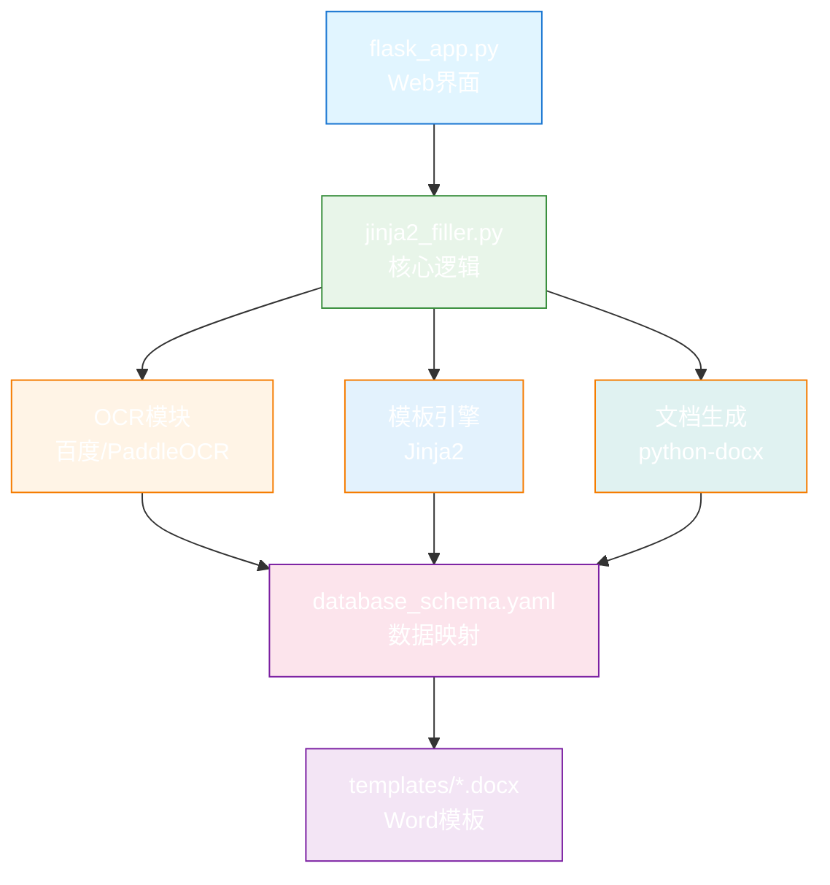
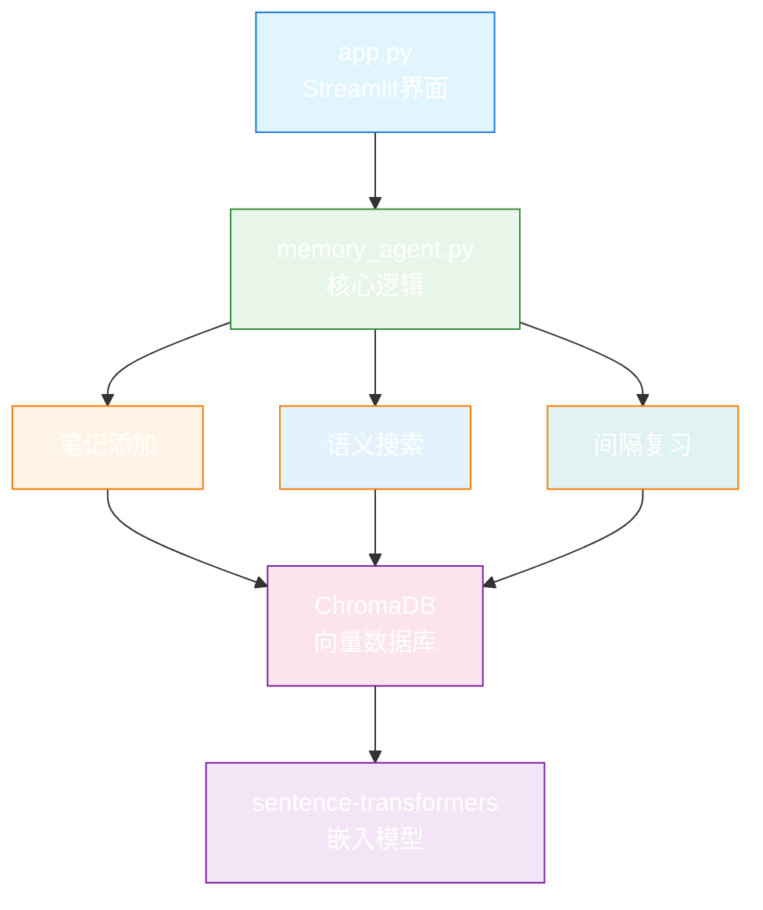
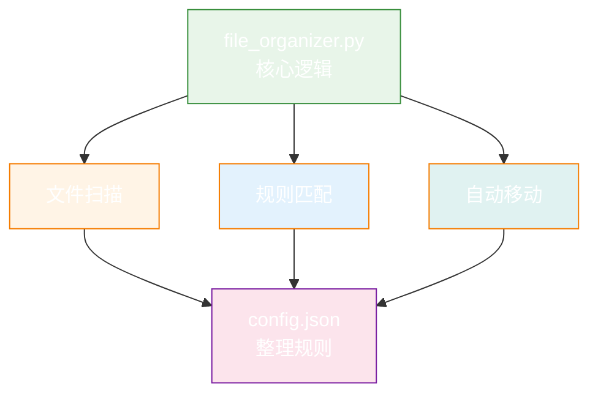

# 🏗️ 系统架构设计

本文档详细说明 Office Agent Workspace 的技术架构、设计模式和组件关系。

**🆕 v2.0 升级** (2026-01-16):
- ✨ 新增 Mermaid 流程图可视化
- ✨ 升级所有 ASCII 流程图为精美图表
- ✅ 实时渲染和在线预览支持

---

## 📐 整体架构

### 三层架构模型



---

## 🧩 核心组件

### 1. AgentTool 框架

**位置**: [00_Agent_Library/agent_toolkit.py](../00_Agent_Library/agent_toolkit.py)

**设计模式**: 工具模式 + 策略模式

```python
class BaseTool:
    """所有工具的基类"""

    def __init__(self, name: str, description: str):
        self.name = name
        self.description = description

    def validate_input(self, **kwargs) -> tuple[bool, str]:
        """验证输入参数"""
        raise NotImplementedError

    def execute(self, **kwargs) -> dict:
        """执行工具逻辑"""
        raise NotImplementedError
```

**核心功能**:
- 统一的工具接口
- 输入验证机制
- 错误处理和日志记录
- 结果标准化

### 2. Workflow Engine

**位置**: [00_Agent_Library/workflow_engine.py](../00_Agent_Library/workflow_engine.py)

**技术栈**: LangGraph

**设计模式**: 状态机模式 + 图模式

```python
class WorkflowEngine:
    """工作流引擎"""

    def __init__(self):
        self.graph = StateGraph()

    def add_node(self, name: str, func: Callable):
        """添加工作流节点"""
        self.graph.add_node(name, func)

    def add_edge(self, from_node: str, to_node: str):
        """添加节点连接"""
        self.graph.add_edge(from_node, to_node)

    def run(self, initial_state: dict) -> dict:
        """运行工作流"""
        return self.graph.invoke(initial_state)
```

**核心功能**:
- 可视化工作流定义
- 状态管理
- 条件分支
- 并行执行

### 3. 技能系统

**位置**: [skills/](../skills/)

**设计模式**: 观察者模式 + 责任链模式

**工作流程**:



**核心组件**:
- **触发器**: 关键词匹配系统
- **加载器**: 技能文档解析器
- **执行器**: 步骤自动化执行
- **验证器**: 结果质量检查

---

## 🎯 智能体架构

### 市场监管智能体

**目录**: [01_Active_Projects/market_supervision_agent/](../01_Active_Projects/market_supervision_agent/)

**架构图**:



**关键模块**:
1. **OCR 识别**: 百度OCR / PaddleOCR
2. **模板引擎**: Jinja2 模板填充
3. **文档生成**: python-docx Word操作
4. **数据映射**: YAML 配置文件

### 记忆助手

**目录**: [01_Active_Projects/memory_agent/](../01_Active_Projects/memory_agent/)

**架构图**:



**关键模块**:
1. **向量化**: sentence-transformers
2. **存储**: ChromaDB 向量数据库
3. **检索**: 语义相似度搜索
4. **复习**: 间隔重复算法

### 文件整理工具

**目录**: [01_Active_Projects/file_organizer/](../01_Active_Projects/file_organizer/)

**架构图**:



**关键模块**:
1. **文件扫描**: 递归目录遍历
2. **规则引擎**: 配置驱动的分类逻辑
3. **文件操作**: 安全的移动和重命名

---

## 🔄 数据流设计

### 申请书生成流程

```mermaid
graph TD
    A[用户上传图片] --> B[Flask 接收请求]
    B --> C[OCR 识别营业执照]
    C --> D[提取结构化数据]
    D --> E[加载 YAML 配置]
    E --> F[映射到模板变量]
    F --> G[Jinja2 渲染模板]
    G --> H[生成 Word 文档]
    H --> I[返回下载链接]

    style A fill:#e1f5ff
    style C fill:#fff4e6
    style G fill:#e3f2fd
    style H fill:#e0f2f1
    style I fill:#e8f6f3

    classDef start fill:#64b5f6,stroke:#1976d2,color:#fff
    classDef process fill:#81c784,stroke:#388e3c,color:#fff
    classDef end fill:#4caf50,stroke:#2e7d32,color:#fff

    class A start
    class B,C,D,E,F,G,H process
    class I end
```

### 知识管理流程

```mermaid
graph TD
    A[用户添加笔记] --> B[Streamlit 接收输入]
    B --> C[文本预处理]
    C --> D[sentence-transformers 向量化]
    D --> E[存储到 ChromaDB]
    E --> F[用户搜索]
    F --> G[查询向量化]
    G --> H[ChromaDB 相似度检索]
    H --> I[返回相关笔记]

    style A fill:#e1f5ff
    style D fill:#fff4e6
    style E fill:#e3f2fd
    style H fill:#fce4ec
    style I fill:#e8f6f3

    classDef start fill:#64b5f6,stroke:#1976d2,color:#fff
    classDef process fill:#81c784,stroke:#388e3c,color:#fff
    classDef end fill:#4caf50,stroke:#2e7d32,color:#fff

    class A start
    class B,C,D,E,F,G,H process
    class I end
```

---

## 🛠️ 技术栈详解

### Web框架

**Flask** (市场监管智能体)
- 轻量级、灵活
- RESTful API设计
- 文件上传处理
- Jinja2模板集成

**Streamlit** (记忆助手)
- 快速原型开发
- 自动UI生成
- 响应式布局
- 内置数据可视化

### 自动化工具

**Playwright**
- 浏览器自动化
- 政务网站登录
- 表单自动填写
- 截图和PDF生成

### AI/ML

**OCR**
- 百度OCR API（云端，高精度）
- PaddleOCR（本地，离线可用）

**向量数据库**
- ChromaDB：轻量级向量存储
- sentence-transformers：文本嵌入

### 文档处理

**python-docx**
- Word文档读写
- 模板填充
- 格式保留

**Jinja2**
- 模板引擎
- 变量替换
- 条件渲染

---

## 📐 设计模式应用

### 1. 工厂模式 (Factory)

```python
class ToolFactory:
    """工具工厂"""

    @staticmethod
    def create_tool(tool_type: str) -> BaseTool:
        if tool_type == "ocr":
            return OCRTool()
        elif tool_type == "filler":
            return TemplateFillerTool()
        # ...
```

### 2. 策略模式 (Strategy)

```python
class OCRStrategy:
    """OCR策略接口"""

    def recognize(self, image_path: str) -> dict:
        raise NotImplementedError

class BaiduOCR(OCRStrategy):
    """百度OCR实现"""

class PaddleOCR(OCRStrategy):
    """PaddleOCR实现"""
```

### 3. 观察者模式 (Observer)

```python
class SkillTrigger:
    """技能触发器"""

    def __init__(self):
        self.observers = []

    def register(self, skill):
        self.observers.append(skill)

    def notify(self, user_input: str):
        for skill in self.observers:
            if skill.match(user_input):
                skill.execute()
```

### 4. 建造者模式 (Builder)

```python
class WorkflowBuilder:
    """工作流构建器"""

    def __init__(self):
        self.workflow = WorkflowEngine()

    def add_step(self, name: str, func: Callable):
        self.workflow.add_node(name, func)
        return self

    def build(self) -> WorkflowEngine:
        return self.workflow
```

---

## 🔐 安全性设计

### 输入验证
- 所有用户输入必须验证
- 文件类型和大小限制
- SQL注入防护
- XSS防护

### 数据隐私
- 本地优先的数据存储
- 敏感信息加密
- 定期清理临时文件
- OCR结果不永久保存

### 权限控制
- 配置文件访问控制
- 输出目录权限管理
- API密钥安全存储

---

## 🚀 性能优化

### 缓存策略
- OCR结果缓存
- 模板预编译
- 向量索引缓存
- 配置文件懒加载

### 并发处理
- 异步OCR请求
- 批量文件处理
- 数据库连接池
- 线程池管理

### 资源管理
- 及时释放文件句柄
- 浏览器资源清理
- 内存使用监控
- 临时文件定期清理

---

## 📊 监控和日志

### 日志系统
```python
import logging

# 配置日志
logging.basicConfig(
    level=logging.INFO,
    format='%(asctime)s - %(name)s - %(levelname)s - %(message)s',
    handlers=[
        logging.FileHandler('logs/app.log'),
        logging.StreamHandler()
    ]
)
```

### 错误追踪
- 统一异常处理
- 错误日志记录
- 用户友好的错误提示
- 调试信息输出

---

## 🔮 扩展性设计

### 插件系统
- 基于AgentTool的插件接口
- 动态加载新工具
- 配置驱动的功能开关

### 工作流扩展
- 可视化工作流编辑器
- 自定义节点类型
- 工作流模板库

### 技能扩展
- 简单的技能定义格式
- 自动技能发现
- 技能组合和链式调用

---

**需要更多信息?** 查看:
- [完整系统指南](../COMPLETE_SYSTEM_GUIDE.md)
- [编码规范](CODING_STANDARDS.md)
- [扩展开发](guides/AGENT_DEVELOPMENT.md)
