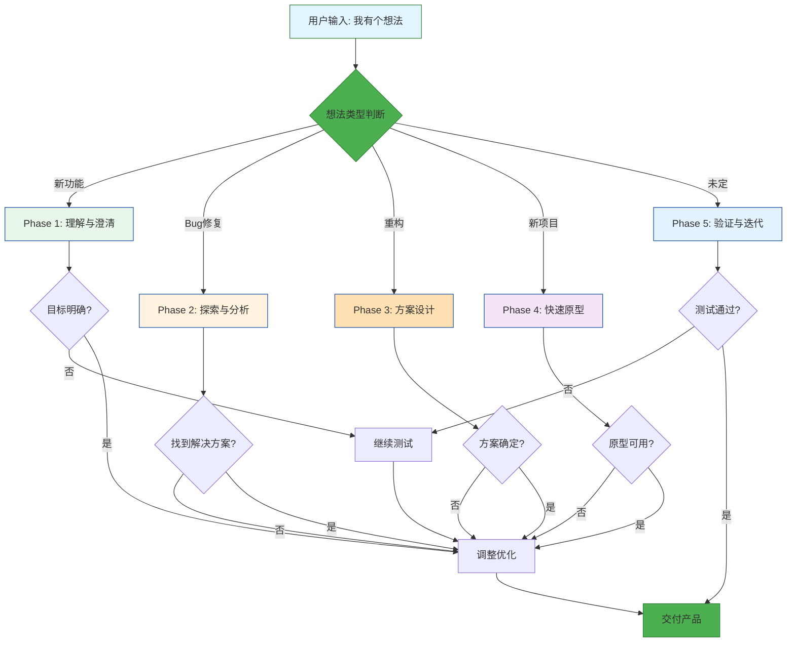
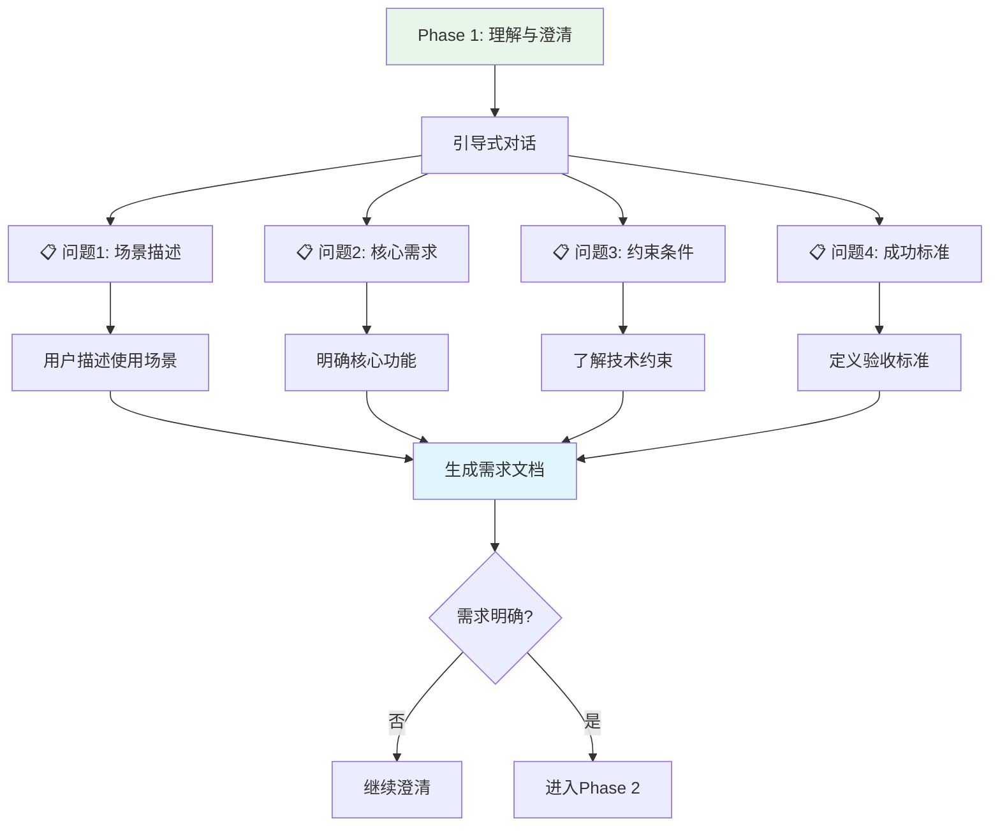
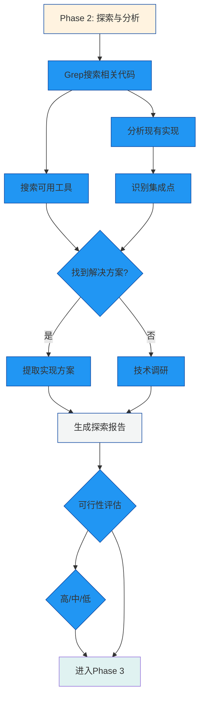
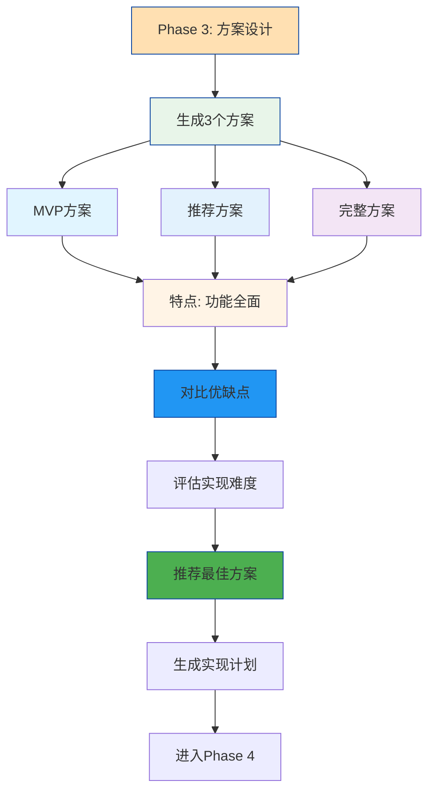
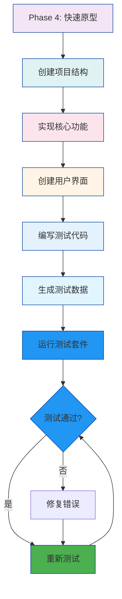
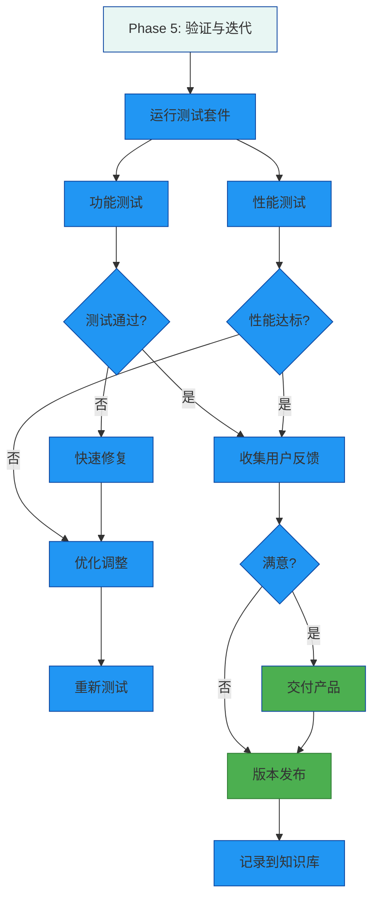

# Idea to Product Skill - 想法落地技能 🚀

**版本**: v3.0 - Mermaid 可视化版
**更新**: 2026-01-16
**升级**: 新增 Mermaid 流程图可视化

---

## 触发关键词

当用户提到以下内容时,自动激活本技能:
- "我有个想法"
- "想添加一个功能"
- "能不能实现..."
- "有个改进建议"
- "新建项目"
- "从零开始做..."
- 任何**模糊的、未结构化的想法表达**

---

## 技能描述

本技能实现从**模糊想法**到**可用产品**的完整落地流程,通过结构化的5阶段方法论,确保想法能够快速、系统地转化为实际可用的代码和功能。

## 🎨 可视化工作流程

### 整体流程图



### Phase 1: 理解与澄清 (Clarification) 🎯



### Phase 2: 探索与分析 (Exploration) 🔍



### Phase 3: 方案设计 (Design) 📐



### Phase 4: 快速原型 (Prototyping) ⚡



### Phase 5: 验证与迭代 (Validation) ✅



---

## 🎯 使用场景示例

### 场景1: 新功能开发

```
输入: "我有个想法，想添加智能推荐功能"
    ↓
Phase 1: 澄清需求
    ├── 目标: 基于用户历史的内容推荐
    ├── 输入: 用户浏览记录
    └── 输出: Top-5推荐列表
    ↓
Phase 2: 探索代码库
    ├── 找到 memory_agent (向量搜索)
    ├── 发现 ChromaDB (向量数据库)
    └── 发现 sentence-transformers (嵌入模型)
    ↓
Phase 3: 方案设计
    ├── MVP: 关键词匹配
    ├── 推荐: 向量相似度
    └── 完整: 深度学习
    ↓
Phase 4: 快速原型
    ├── 创建 recommender/
    ├── 实现 RecommenderEngine
    ├── 编写 API 接口
    └── 编写测试
    ↓
Phase 5: 验证交付
    ├── 运行 pytest (15个测试通过)
    ├── 性能测试 (0.8s < 1s ✅)
    └── 准确率测试 (75% > 70% ✅)
    ↓
时间: < 1.5小时 → 可用原型
```

---

## 🚀 下一步

### 立即体验

1. **在 VSCode 中安装 Mermaid Chart 扩展**
   - 搜索 "Mermaid Chart Preview"
   - 点击安装

2. **查看升级后的流程图**
   - 打开 [skills/super-butler/SKILL.md](skills/super-butler/SKILL.md)
   - 查看实时渲染的 Mermaid 流程图

3. **升级其他技能文档**
   - [skills/application-generator/SKILL.md](skills/application-generator/SKILL.md)
   - [skills/knowledge-indexer/SkILL.md](skills/knowledge-indexer/SKILL.md)
   - [skills/license-organizer/SKILL.md](skills/license-organizer/SKILL.md)

---

**技能版本**: v3.0 - Mermaid 可视化版
**更新日期**: 2026-01-16
