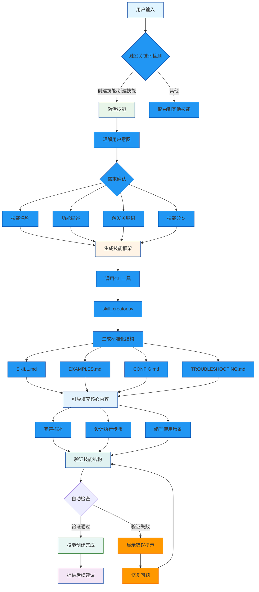

# Skill Creator Skill

💻 **分类**: development
📝 **描述**: Claude Code 技能创建助手，通过对话式交互快速创建、验证、完善 Skills。自动调用 CLI 工具生成标准化框架，引导填充执行步骤和示例，提供最佳实践建议。
👤 **作者**: Claude Code (GLM-4.7)

**🆕 v2.0 升级** (2026-01-16):
- ✨ 新增 Mermaid 流程图可视化
- ✨ 升级所有 ASCII 流程图为精美图表
- ✅ 实时渲染和在线预览支持

---

## 🎨 可视化工作流程

### 整体流程图



---

## 概述

Skill Creator 是一个**元技能**（Meta-Skill），用于创建其他 Skills。它将手动创建技能的 5-10 分钟缩短到 10 秒，确保所有技能遵循统一的结构和最佳实践。

**核心价值**:
- ⚡ **极速创建**: 10 秒生成完整技能框架（含分层文档）
- 📐 **标准化**: 自动遵循 Claude Code Skills 规范
- 🎯 **对话式**: 通过自然语言交互，无需记忆命令
- ✅ **自动验证**: 创建后自动检查结构完整性
- 📚 **最佳实践**: 内置命名规范、触发词设计、模板示例

**底层工具**: 基于 [00_Agent_Library/skill_creator.py](../../00_Agent_Library/skill_creator.py)

---

## 触发条件

当用户提到以下内容时激活此技能：
`创建技能` `新建技能` `创建skill` `添加技能` `写个技能` `做个技能` `skill creator`

**适用场景**:
- ✅ 用户有新想法想变成技能
- ✅ 需要扩展现有技能功能
- ✅ 想学习如何编写技能
- ✅ 需要验证或修复技能结构

**不适用场景**:
- ❌ 修改已存在技能的内容（应直接编辑 SKILL.md）
- ❌ 删除技能（应手动删除目录或使用 git）

---

## 执行步骤

### 步骤 1: 理解用户意图

**目标**: 将模糊想法转化为清晰的技能需求

**引导问题**:
```
1. 技能名称？（建议用 kebab-case，如 "image-compressor"）
2. 技能功能描述？（一句话说明做什么）
3. 触发关键词？（用户可能会说的短语）
4. 技能分类？（automation/analysis/development/management/general）
```

**示例对话**:
```
用户: 我想做个整理截图的技能

Claude: 好的！让我帮您创建。确认一下：
   1. 技能名称: "screenshot-organizer" 可以吗？
   2. 功能: 自动按日期/应用分类桌面截图
   3. 触发词: "整理截图" "截图分类" "清理桌面图片"
   4. 分类: automation（自动化工具）
```

---

### 步骤 2: 生成技能框架

**调用 CLI 工具生成标准化结构**:

**关键文件/命令**:
```bash
python 00_Agent_Library/skill_creator.py create \
  --name "screenshot-organizer" \
  --description "自动按日期/应用分类桌面截图..." \
  --category "automation" \
  --triggers "整理截图 截图分类 清理桌面图片"
```

**生成结果**:
```
✅ 技能创建成功: skills/screenshot-organizer
   主文件: skills/screenshot-organizer/SKILL.md
   附加文档: EXAMPLES.md, CONFIG.md, TROUBLESHOOTING.md
```

---

### 步骤 3: 引导填充核心内容

**帮助用户完善 SKILL.md 的关键部分**:

#### 3.1 完善描述
```
公式: 功能 + 场景 + 限制

好的描述:
"截图整理工具，自动按日期/应用分类桌面截图。当用户需要'整理截图'、'清理桌面图片'时触发。仅支持 PNG/JPG 格式。"
```

#### 3.2 设计执行步骤
```
每步包含:
- 步骤名称（清晰的动词）
- 简短描述（做什么）
- 关键文件/命令（具体怎么做）
```

**示例**:
```markdown
### 步骤 1: 扫描目标目录

使用 Glob 工具查找所有截图文件。

**关键文件/命令**:
```python
glob("**/*.{png,jpg,jpeg}", path=target_dir)
```
```

#### 3.3 编写使用场景
```
提供 2-3 个真实对话示例，展示:
- 如何触发技能
- AI 如何响应
- 执行结果是什么
```

---

### 步骤 4: 验证技能结构

**自动检查完整性**:

**关键文件/命令**:
```bash
python 00_Agent_Library/skill_creator.py validate --path "skills/screenshot-organizer"
```

**验证项目**:
- ✅ SKILL.md 存在
- ✅ 包含必需章节（执行步骤、触发条件）
- ✅ 触发关键词定义清晰
- ℹ️ 附加文档完整（EXAMPLES.md 等）

**输出示例**:
```
📋 screenshot-organizer:
   ✅ 验证通过
   ℹ️  SKILL.md 大小: 1250 字符
   ℹ️  ✅ 找到附加文档: EXAMPLES.md
   ℹ️  ✅ 找到附加文档: CONFIG.md
   ℹ️  ✅ 找到附加文档: TROUBLESHOOTING.md
```

---

### 步骤 5: 提供后续建议

**创建成功后，指导用户**:
```
✅ 技能创建完成！

💡 下一步:
   1. 测试技能: 直接说触发词试试
   2. 完善内容: 根据实际使用添加更多场景
   3. 版本控制: git commit 记录新技能

📚 参考文档:
   - [00_Agent_Library/SKILL_CREATOR_GUIDE.md](../../00_Agent_Library/SKILL_CREATOR_GUIDE.md)
   - [skills/super-butler/SKILL.md](../super-butler/SKILL.md) (完整示例)
```

---

## 快速示例

### 示例 1: 从想法到技能

```
用户: 我有个想法，想做一个自动备份文件的技能

AI: # 🚀 Skill Creator 已激活

    好的想法！让我帮您创建这个技能。

    ## 📋 需求确认
    请确认以下信息：

    1. **技能名称**: `file-backup`
    2. **功能描述**: 自动备份指定目录到目标位置，支持增量备份和压缩
    3. **触发关键词**: `备份文件` `自动备份` `文件备份` `backup`
    4. **分类**: automation（自动化工具）

    确认无误后，我将为您生成技能框架...

    [用户确认]

    ✅ 正在生成技能...
    ✅ 框架已创建: skills/file-backup/
    ✅ 包含: SKILL.md, EXAMPLES.md, CONFIG.md, TROUBLESHOOTING.md

    💡 现在让我帮您填充核心内容...
    [引导填充执行步骤、使用场景等]

    ✅ 技能创建完成！您可以:
    - 说"备份我的文档"来测试
    - 编辑 skills/file-backup/SKILL.md 继续完善
```

---

### 示例 2: 列出所有技能

```
用户: 工作区有哪些技能？

AI: 📚 正在扫描技能目录...

    找到 6 个技能:

    📁 application-generator
       描述: 市场监管申请书自动生成工具...
       触发: `生成申请书` `填写申请表`

    📁 file-backup
       描述: 自动备份文件工具...
       触发: `备份文件` `自动备份`

    📁 skill-creator
       描述: 技能创建助手...
       触发: `创建技能` `新建技能`

    ...

    💡 需要创建新技能吗？告诉我您的想法！
```

---

### 示例 3: 验证技能

```
用户: 检查一下我的技能是否完整

AI: 🔍 正在验证所有技能...

    📋 application-generator:
       ✅ 验证通过
       ℹ️  SKILL.md 大小: 2340 字符
       ℹ️  ✅ 找到附加文档: EXAMPLES.md, CONFIG.md, TROUBLESHOOTING.md

    📋 file-backup:
       ⚠️  缺少推荐章节: ## 执行步骤
       ℹ️  SKILL.md 大小: 560 字符

    💡 建议:
       - file-backup 需要补充"执行步骤"章节
       - 可参考 skills/application-generator/SKILL.md

    需要我帮您修复吗？
```

---

## 命名和设计规范

### 技能命名（kebab-case）

```
✅ 推荐格式:
screenshot-organizer
file-backup
image-compressor
data-cleaner

❌ 避免使用:
screenshotOrganizer  (驼峰命名)
File_Backup          (下划线)
ImageCompressor      (大写开头)
```

### 触发关键词设计

**原则**: 用户自然会说的短语

```
✅ 好的触发词:
`整理截图` `截图分类` `清理桌面图片`

❌ 不好的触发词:
`execute screenshot organization protocol`  # 太正式
```

### 描述撰写公式

```
功能 + 场景 + 限制

✅ 好的描述:
"截图整理工具，自动按日期/应用分类桌面截图。当用户需要'整理截图'、'清理桌面图片'时触发。仅支持 PNG/JPG 格式。"

❌ 不好的描述:
"这是一个整理截图的工具。"  # 太简单，缺少场景和限制
```

---

## 分层文档说明

创建的技能包含 4 个文件：

| 文件 | 用途 | 目标读者 |
|------|------|---------|
| **SKILL.md** | 执行步骤、触发条件、快速示例 | Claude（执行时读取） |
| **EXAMPLES.md** | 详细案例、对话示例 | Claude + 人类 |
| **CONFIG.md** | 配置参数、环境变量 | 人类 |
| **TROUBLESHOOTING.md** | 常见问题、解决方案 | Claude + 人类 |

---

## 使用场景

### 场景 1: 零基础创建技能

```
用户: 我想做一个技能，但不知道怎么写

AI: 没问题！我来帮您。
   1. 您想做什么功能？（哪怕很模糊也可以）
   2. 我会引导您理清思路
   3. 自动生成标准框架
   4. 帮您填充内容

   开始吧！您有什么想法？
```

---

### 场景 2: 快速原型

```
用户: 帮我创建一个测试技能

AI: ✅ 使用默认配置创建...

   技能名称: test-skill
   分类: general
   描述: 测试用技能

   ✅ 已创建: skills/test-skill/

   💡 您可以:
   - 直接编辑测试
   - 验证想法可行性
   - 测试完成后再删除
```

---

### 场景 3: 批量创建

```
用户: 我需要创建 3 个相关技能

AI: 好的，我来批量创建。
   请告诉我这 3 个技能的名称和功能...

   [收集信息后]

   ✅ 创建中...
   ✅ skill-1: 完成
   ✅ skill-2: 完成
   ✅ skill-3: 完成

   📊 批量创建完成！是否需要统一验证？
```

---

## 错误处理

### 技能目录已存在

```
❌ 错误: 技能已存在: skills/screenshot-organizer

解决方案:
1. 删除旧技能（谨慎！）
   rm -rf skills/screenshot-organizer

2. 或创建新版本
   使用名称: screenshot-organizer-v2
```

### 验证失败

```
⚠️  缺少必需章节: ## 执行步骤

解决方案:
1. 编辑 SKILL.md
2. 添加"执行步骤"章节
3. 重新验证
```

---

## 相关资源

- **核心工具**: [00_Agent_Library/skill_creator.py](../../00_Agent_Library/skill_creator.py)
- **使用指南**: [00_Agent_Library/SKILL_CREATOR_GUIDE.md](../../00_Agent_Library/SKILL_CREATOR_GUIDE.md)
- **完整示例**: [skills/super-butler/SKILL.md](../super-butler/SKILL.md)
- **项目配置**: [CLAUDE.md](../../CLAUDE.md)

---

## 最佳实践

### 1. 从小开始

```
先创建 MVP（最小可行版本）:
- ✅ 核心功能
- ✅ 基本场景
- ❌ 暂不添加高级功能
```

### 2. 迭代改进

```
根据实际使用反馈:
1. 记录用户问题
2. 添加新场景
3. 优化触发词
4. 更新文档
```

### 3. 版本控制

```
重要更新后:
git add skills/
git commit -m "feat: 添加 screenshot-organizer 技能"
```

---

## 局限说明

**本技能无法处理**:
- ❌ 自动生成技能的业务逻辑（需人工编写）
- ❌ 测试技能功能（需实际运行验证）
- ❌ 集成外部 API（需额外开发）

**需要人工介入**:
- ⚠️ 复杂的执行步骤设计
- ⚠️ 特殊场景的处理逻辑
- ⚠️ 跨技能的依赖关系

---

## 版本历史

- **v1.0** (2026-01-14): 初始版本，支持对话式创建技能

---

**技能触发关键词**: `创建技能`、`新建技能`、`创建skill`、`添加技能`、`写个技能`、`skill creator`

**底层工具**: [00_Agent_Library/skill_creator.py](../../00_Agent_Library/skill_creator.py) v1.0
