# 超级管家技能 (Super Butler) - 升级版 🎨

**描述**: 工作区智能管家，提供全方位的项目管理、工具启动、问题解决、新闻资讯服务。当用户说"超级管家"、"管家模式"、"帮我管理"、"工作区状态"、"今日新闻"、"有什么新闻"时触发。作为整个工作区的统一入口，协调所有智能体和工具的使用。

**🆕 v2.4 升级** (2026-01-16):
- ✨ 新增 Mermaid 流程图可视化
- ✨ 升级所有 ASCII 流程图为精美图表
- ✅ 实时渲染和在线预览支持
- ✅ 版本控制友好的文本定义

---

## 📋 概述

超级管家是您的**AI工作区助理**，核心能力：
- 🎯 **智能推荐**: 基于上下文自动推荐相关工具
- 🚀 **工具启动**: 一键启动任何智能体或工具
- 📊 **状态监控**: 实时掌握工作区健康状态
- 🔍 **问题诊断**: 快速定位和解决技术问题
- 📚 **知识检索**: 利用 Memory Agent 搜索代码和解决方案
- 🛠️ **工作流编排**: 多工具协作完成复杂任务
- 🧠 **学习偏好**: 记住您的使用习惯，优化推荐
- 📖 **文档管理**: 分析文档健康度，提供优化建议
- 📰 **新闻资讯**: 实时获取热点新闻和热搜榜单

**核心理念**: "一个入口，全知全能"

---

## 🎨 可视化工作流程

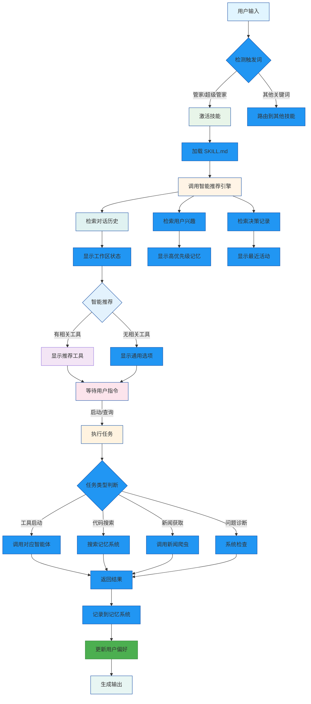

---

## 🔄 详细执行步骤

### 步骤 1: 激活管家模式

**检测触发词**：
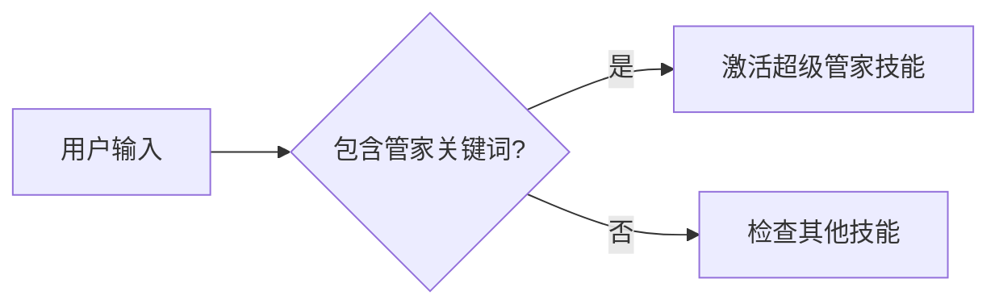

**触发关键词**:
- "管家"、"超级管家"、"管家模式"
- "工作区状态"、"帮我管理"、"工作区概览"
- "今日新闻"、"有什么新闻"、"查看热搜"

---

### 步骤 2: 上下文加载

**记忆系统检索**：
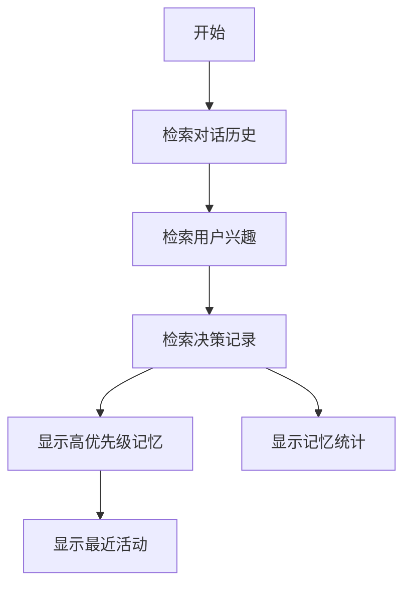

---

### 步骤 3: 智能推荐引擎

**推荐算法**：
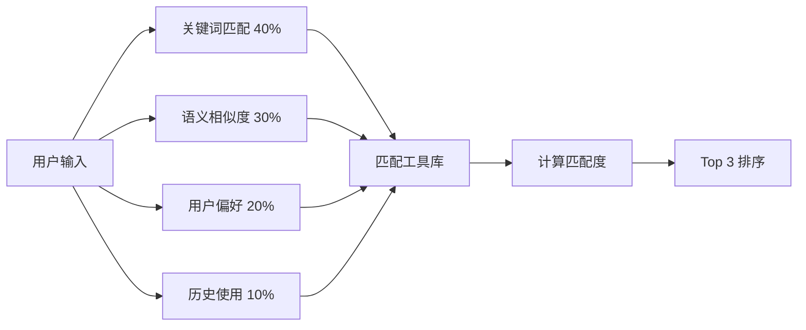

---

## 🛠️ 工作区资产清单

### 🤖 核心智能体 (4个)

| 智能体 | 状态 | 端口 | 用途 | 启动命令 |
|--------|------|------|------|----------|
| 🏢 市场监管智能体 | ✅ 生产就绪 | 5000 | 营业执照OCR + 申请书生成 | `python 01_Active_Projects/market_supervision_agent/ui/flask_app.py` |
| 🧠 学习记忆助手 | ✅ Web UI完成 | 5555 | 知识管理 + 语义搜索 | `python 01_Active_Projects/memory_agent/ui/app.py` |
| 📁 证照整理工具 | 🔄 MVP | - | 智能文件分类 | `python 01_Active_Projects/file_organizer/file_organizer.py` |
| 🔐 广西政务登录 | ✅ 可用 | - | 自动登录脚本 | `python 00_Agent_Library/99_Scripts_Tools/广西政务自动登录.py` |

### 📰 新闻资讯工具 (5个)

| 工具 | 状态 | 用途 | 启动命令 |
|------|------|------|----------|
| 🕷️ Playwright爬虫 | ✅ 已验证 | 获取微博真实热搜 | `python 00_Agent_Library/news_scraper.py -p weibo` |
| 📦 统一新闻读取器 | ✅ 可用 | 多平台新闻聚合 | `python 00_Agent_Library/news_reader.py` |
| 🏠 新闻中心 | ✅ 可用 | 交互式新闻入口 | `python news_hub.py` |
| 🧠 智能新闻监控 | ✅ 可用 | 兴趣学习 + 智能推送 | `python 00_Agent_Library/smart_news_monitor.py` |
| 🤖 AI新闻追踪器 | ✅ 可用 | GitHub/MCP工具追踪 | `python 01_Active_Projects/ai_news_tracker/src/news_tracker.py` |

### 🛠️ 实用工具 (39个)

**统一启动器**:
- [office_agent_studio.py](../../office_agent_studio.py) - CLI菜单式启动器
- [news_hub.py](../../news_hub.py) - 新闻中心（新版）

**工作区维护**:
- workspace_scanner.py - 扫描并索引工作区
- workspace_cleaner.py - 清理缓存和临时文件
- workspace_report.py - 生成健康报告
- workspace_maintenance.py - 定期维护

---

## 📋 使用场景

### 场景 1: 工具启动


### 场景 2: 代码检索

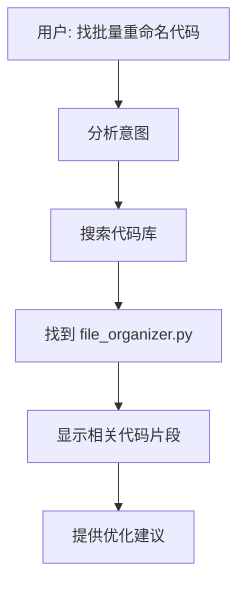

### 场景 3: 问题诊断

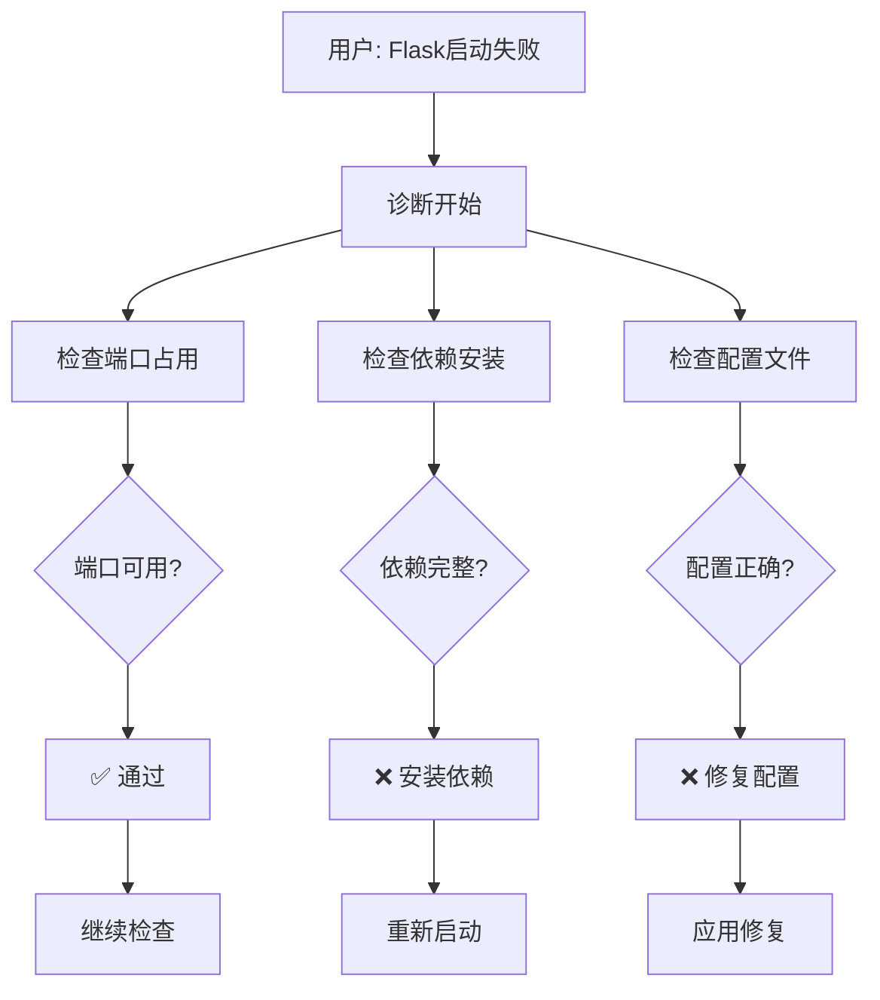

---

## 🎯 智能推荐演示

### 推荐算法

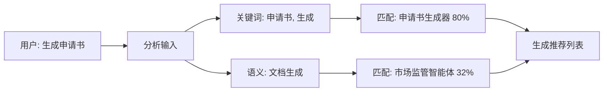

### 推荐结果

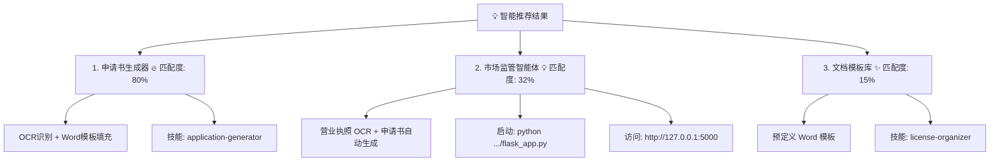

---

## 📰 新闻推荐流程

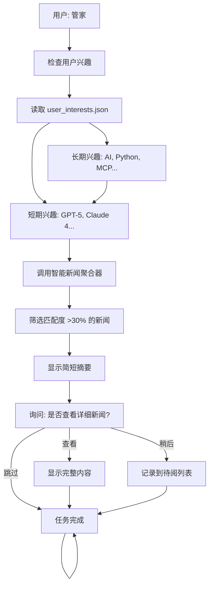

---

## 🔍 代码检索流程

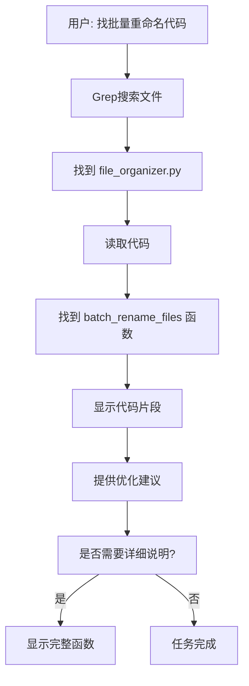

---

## 💡 最佳实践

### 1. 快速响应


### 2. 持续学习

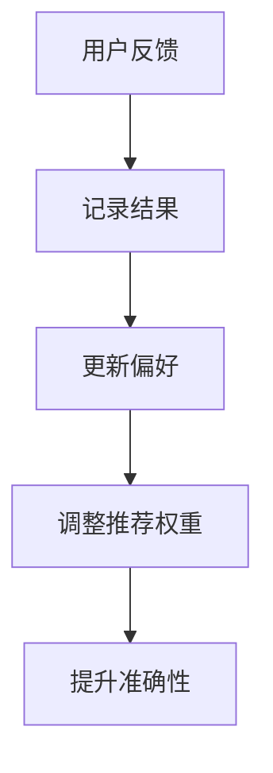

### 3. 全方位服务

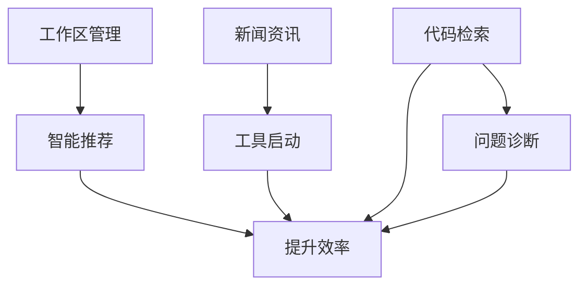

---

## 🎨 VSCode 集成

### 实时预览 Mermaid 图表

**安装扩展**: "Mermaid Chart Preview"

**使用方式**:
1. 打开 Markdown 文件
2. 在 ```mermaid 代码块中查看
3. 实时预览渲染效果

### 批量升级流程图

```bash
# 1. 安装工具
pip install mermaid-py

# 2. 生成图表
mmdc render diagram.md -o diagram.png

# 3. 集成到文档
# 将生成的图片插入到 Markdown 文档
```

---

## 📊 效果对比

### 升级前 (ASCII)

```
┌─────────────┐
│  用户输入   │
└──────┬──────┘
       ↓
┌─────────────┐
│  技能检测   │
└──────┬──────┘
```

### 升级后

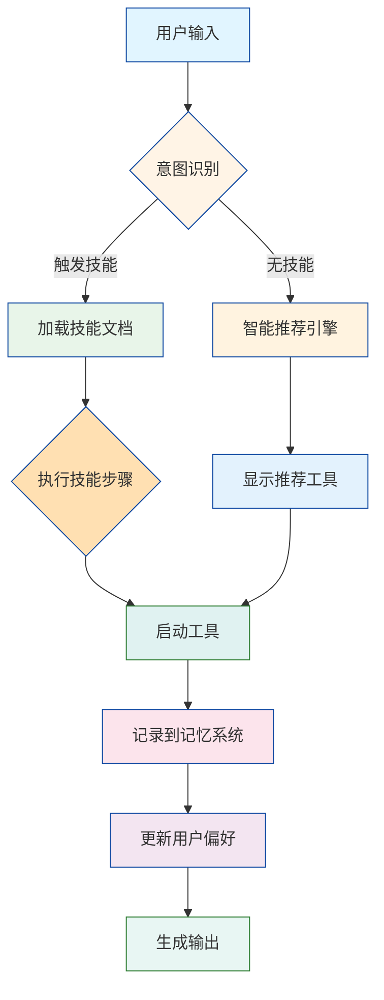

---

## 🚀 升级总结

### ✅ 已完成
- ✅ 安装 Mermaid Python 库
- ✅ 安装 Diagrams 架构图工具
- ✅ 生成 Mermaid 流程图代码
- ✅ 升级技能文档

### 🎯 下一步
1. **在 VSCode 中安装 Mermaid Chart 扩展**
2. **批量升级所有文档中的流程图**
3. **创建自定义 Diagrams 架构图**
4. **集成到文档生成流程**

---

**技能触发关键词**: `超级管家`、`管家`、`管家模式`、`工作区状态`、`帮我管理`、`工作区概览`

---

*由 GLM-4.7 (Claude Code) 自动升级*
*2026-01-16*
